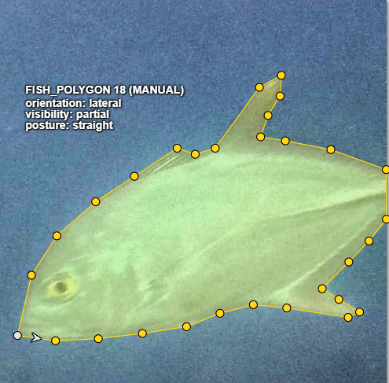

# Annotation portfolio: images, video, text and audio

Completed annotation work by **Arid Ahsan Dodul**. This portfolio shows the labels, the decisions behind them, and the export checks that caught errors the editor did not.

## Completed scope

| Modality | Work delivered | Public evidence |
|---|---|---|
| Images | Five platforms; ten-image design covering boxes, polygons, five-landmark skeletons and masks | [Images and platform results](#image-platform-results), native CVAT/Roboflow packages, screenshots |
| Video | CVAT: 300 frames, six tracks, 762 visible boxes | [Tracking method](video_annotation_guidelines_v6.md), schema, provenance and review findings |
| Text | Label Studio: 22 aquaculture abstracts, 405 entity spans, 938 result records | [Text case study](MODALITY_CASE_STUDIES.md#text-exact-spans-and-scoped-attributes), working XML configuration |
| Audio | Label Studio: 12 conversational clips, approximately 36 minutes, 323 regions, 1,185 result records | [Audio case study](MODALITY_CASE_STUDIES.md#audio-speakers-backchannels-and-silence), working XML configuration |

All four runs are closed as of 15 September 2026. Counts describe delivered scope, not accuracy scores. Native video, text and audio exports are retained privately.

## Start with the decisions

- **[Edge cases](edge_case_log.md):** ambiguous fish boundaries, exclusions and tracking decisions, with screenshot evidence.
- **[Text and audio case studies](MODALITY_CASE_STUDIES.md):** exact percentage spans, backchannels versus overlap, silence rules and accidental region nesting.
- **[Platform comparison](platform_comparison_log.md):** measured workflow differences, export defects and the limits of each comparison.
- **[Image guidelines](annotation_guidelines_v4.md):** rules and dated revisions. The filename is retained for stable links; content is version 5.3.
- **[Schema notes](SCHEMA_README.md):** representation differences and why raw annotation counts cannot be compared directly.

## Image platform results

| Platform | Verified scope |
|---|---|
| CVAT | 10 images, 30 annotation records, 29 distinct objects; one fish has paired manual and assisted masks |
| Roboflow | Fixed 5-image polygon/mask subset, 14 annotations |
| Supervisely | 10 images, 30 objects |
| Label Studio | 10 images, 37 regions and 87 comparable attribute values |
| Labelbox | 10 images, 37 normalized objects; exported masks downloaded and checked |

Five independent landmarks replace a grouped skeleton in Label Studio and Labelbox. Roboflow is a reduced-schema subset. [The normalization](SCHEMA_README.md) explains the differences.

[Browse the screenshot evidence](ScreenShots/README.txt) or [open the public Roboflow dataset](https://universe.roboflow.com/arid-dodul/aquaculture-fish-segmentation).

## Measurements worth reading

- **CVAT, frame 09:** 701 seconds manually versus 74 seconds with SAM 3, a 9.47x speed-up; mask IoU 0.9605.
- **Supervisely, frame 09:** 389.83 seconds manually versus 42.10 seconds with ClickSEG, a 9.26x speed-up. On frame 10, ClickSEG covered only 65.1% of the CVAT-assisted mask.
- **Attribute repeatability:** Supervisely matched 66/66 comparable CVAT values, with three supplied during setup; the independent portion was 63/63. Label Studio matched 87/87.
- **Export fidelity:** CVAT COCO dropped two skeleton records while still advertising the keypoint schema. The Roboflow audit found six defects, including bounding-box area stored as segmentation area.
- **Video:** 765 box records contain 762 visible boxes and three outside terminators. All 2,286 visible-box attribute values match the twenty-range log.

These small, same-annotator comparisons measure repeatability and workflow behavior. They do not establish inter-annotator agreement, independent accuracy or general platform performance. Video placement was manual; interpolation performance and working time were not measured.

## Sources and publication boundary

This repository's own material is MIT licensed ([LICENSE](LICENSE)). The source datasets keep their own terms ([NOTICE](NOTICE)):

- **Images:** [UnderWater Fish Detection, Roboflow Universe v6](https://universe.roboflow.com/underwater-fish/underwater-fish-detection-izi1l), CC BY 4.0. Original labels were not used. [Filename mapping](SOURCE_FILENAMES.txt).
- **Video:** [Tilapia-RAS Dataset](https://doi.org/10.5281/zenodo.17518786), CC BY 4.0. [Clip selection and provenance](VIDEO_SOURCE_PROVENANCE.txt).
- **Text:** 22 open-access MDPI aquaculture abstracts; source/licence basis and review limits are recorded in the [case study](MODALITY_CASE_STUDIES.md).
- **Audio:** [EdAcc](https://doi.org/10.7488/ds/7914), CC BY-SA 4.0. Source audio and transcript references are not redistributed here.

Only reviewed public material is included. Native Label Studio, Labelbox and Supervisely packages are withheld because they contain account, user, signed-link or local-path metadata. Resumes and private working records are not part of this repository.

[FILE_MANIFEST.sha256](FILE_MANIFEST.sha256) records the SHA-256 of every release file except itself.
