# Edge Cases — Fish Annotation Portfolio

**Project:** Fish detection, behaviour and morphology
**Guidelines:** v4.3 at the time these were raised; the guidelines are now at **v5.3**, and nine of
the revisions between the two were made in response to the entries below.
**Dataset:** UnderWater Fish Detection (Roboflow Universe), CC BY 4.0
**Raised by:** Arid Ahsan Dodul
**Date:** 4 August 2026 — CVAT baseline run

Questions raised during production. Each one is something the guidelines don't answer cleanly, or answer in a way that doesn't survive contact with the actual image. Where there is no reviewer to escalate to, I have made the call myself and marked it as a pending decision so it can be overruled later.

Fill these in **as they come up**, not at the end of the batch.

---

## Part 1 — Questions raised during annotation

---

| **1.** |
| :---- |
| 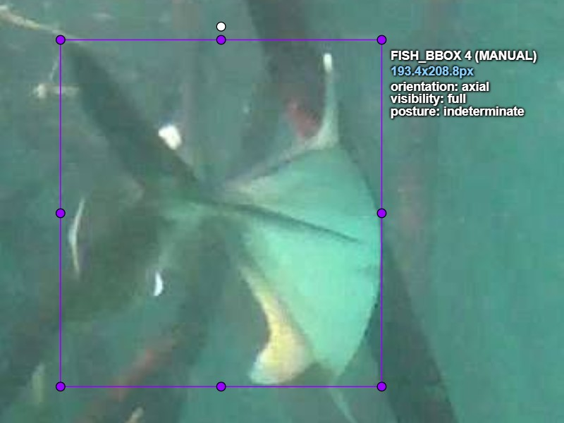 |
| *01_bbox — `FISH_BBOX 4`, 193.4 x 208.8 px. The tail-on instance that raised the question.* |
| **Image:** 01_bbox.jpg — the large tail-on fish, upper centre of frame (`fish_bbox`, 195 x 208 px) |
| **Question:** This fish is facing away from the camera, tail toward us, so its head isn't visible at all. But nothing is in front of it — it's the fish's own body hiding its head. `visibility: full` is defined as the whole body being resolvable, and the head isn't resolvable here. Does that make it `partial`, or is `full` only about things blocking the view? |
| **My read:** `full`. The angle is why the head is missing, not an occluder, and `orientation` already has a value for exactly this situation — `axial`. If I also mark `visibility: partial`, the same fact gets recorded twice and `visibility` stops meaning what it is there to mean. The whole animal is in frame and nothing is in front of it. |
| **Decision taken:** Annotated. `orientation: axial`, `visibility: full`, `posture: straight`. My first call was `lateral` and it was wrong — a broadside fish shows its head, so `lateral` and a missing head can't both be true. Caught it before moving to the next instance. |
| **Guideline gap?** **Yes.** v4.2 never said which attribute owns "part of the fish isn't visible". Two annotators could both follow it correctly and record this fish differently, which makes it a definition gap rather than a mistake. Proposed wording, now in v4.3: *"A part hidden by the fish's own pose is recorded in `orientation`. `visibility` records only what an external occluder or the frame edge takes away."* Added a consistency check with it: `lateral` plus an unreadable head is contradictory, so one of the two attributes is wrong. |

---

| **2.** |
| :---- |
| 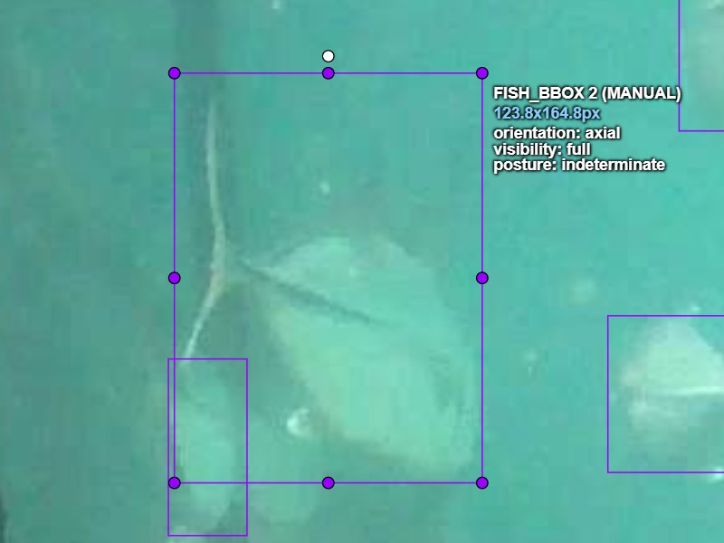 |
| *01_bbox — `FISH_BBOX 2`, 123.8 x 164.8 px. One of the five instances now carrying `posture: indeterminate`.* |
| **Image:** 01_bbox.jpg — every instance in the frame carrying `orientation: axial` (5 of 7 when this entry was written; **4 of 7 in the delivered export**, after entry 4 reclassified one instance from `axial` to `indeterminate`) |
| **Question:** `posture` records whether the body is straight or curved. On an axial fish the body axis points at the camera, so a curve is foreshortened to almost nothing and I can't separate a straight fish from a bent one. I've been leaving `straight`, which is the tool's default value rather than something I observed. Right now 7 of 7 instances in this frame say `posture: straight`. Should axial fish get `straight`, or `indeterminate`? |
| **My read:** `indeterminate`. `straight` is a positive claim about the animal and I can't support it on a fish pointing at the lens. It is also the default, so leaving it is indistinguishable in the export from never opening the attribute panel at all. An attribute that reads the same on every instance carries no information, which is a worse outcome than not collecting it. |
| **Decision taken:** Made it a rule rather than a judgment call per instance: **`orientation: axial` implies `posture: indeterminate`.** Applied to every axial instance in the frame. `oblique` stays case-by-case, since a partially foreshortened body still shows curvature. Stated as a cross-attribute constraint so it can be verified by query — "any instance where `orientation` is `axial` and `posture` is not `indeterminate`" — rather than by eye. |
| **Guideline gap?** **Yes.** v4.3 defines `posture` independently of `orientation` and never says the two interact. Proposed for v4.4: *"Where `orientation` is `axial`, `posture` is `indeterminate`. Body curvature is not measurable along the optical axis. Any instance with `orientation: axial` and any other posture value is a verification failure."* Pending in one respect — a reviewer who wanted posture on axial fish would have to define it from fin geometry instead, which is a different rule and a slower one. |

---

| **3.** |
| :---- |
| 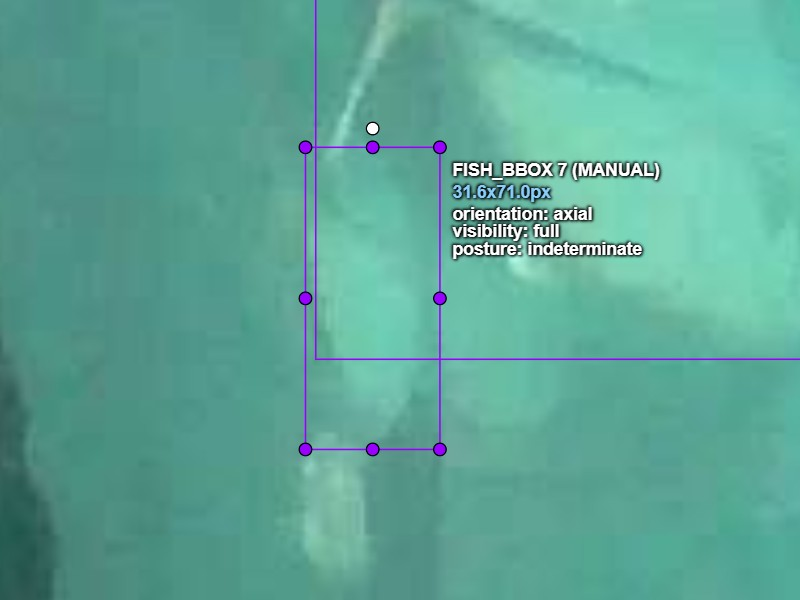 |
| *01_bbox — `FISH_BBOX 7`, 31.6 x 71.0 px. The smallest annotated instance in the batch; `visibility` corrected from `heavy_occlusion` to `full`.* |
| **Image:** 01_bbox.jpg — the smallest annotated instance, 31.6 x 71.0 px, lower right of the group |
| **Question:** This fish is degraded by the water column, not hidden by anything. Nothing is in front of it and it sits well inside the frame. I recorded `visibility: heavy_occlusion` because it was the closest value available, but that's wrong under v4.3 — visibility records only what an external occluder or the frame edge takes away, and turbidity is neither. The schema offers `full`, `partial`, `heavy_occlusion` and no way to say "present but degraded." What do I record? |
| **My read:** The value I used is wrong and there is no right one. This is a missing value in the schema, not a judgment call on the image. The obvious fix is a `turbid` value on `visibility`, or a separate `image_quality` field — but I don't think I should make either change now. |
| **Decision taken:** **Left the schema alone**, deliberately. Changing it mid-batch would mean early frames and late frames carry different fields, and the attribute-drift comparison this batch exists to produce would be meaningless. Corrected that instance under the existing rules instead: `visibility: full`. The whole animal is in frame with nothing in front of it, which is what `full` actually asserts. The murk it sits in is real and is simply not something this schema records. Gap carried to v5 and applied to a fresh batch rather than retrofitted to this one. |
| **Guideline gap?** **Yes, and knowingly left unfixed.** Proposed for v5: either a `turbid` value on `visibility`, or a separate `image_quality: clear / degraded` attribute. The second is cleaner, because turbidity is a property of the image and not of how much of the animal is present — but it adds a fourth required field, so it has to be decided before a batch starts, not during one. |

---

| **4.** |
| :---- |
| 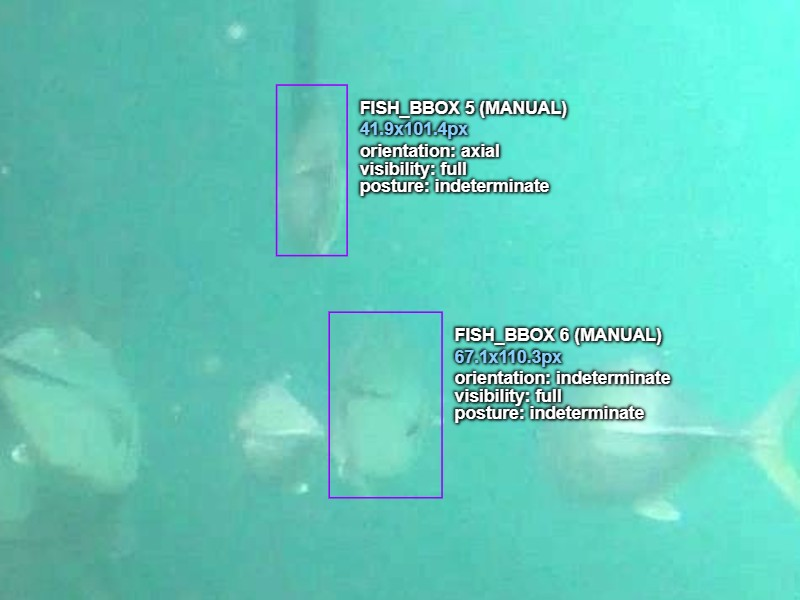 |
| *01_bbox — `FISH_BBOX 5` (41.9 x 101.4) and `FISH_BBOX 6` (67.1 x 110.3). The narrow silhouette reads `axial`; the rounded blur has no long axis and reads `indeterminate`.* |
| 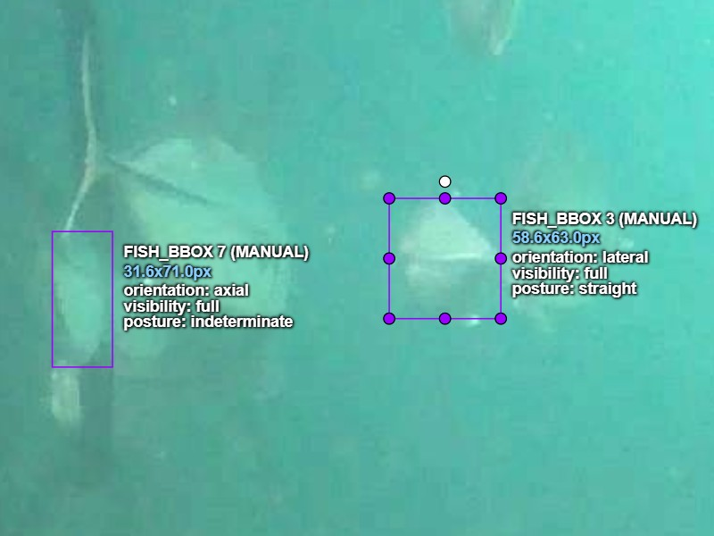 |
| *01_bbox — `FISH_BBOX 7` (31.6 x 71.0) and `FISH_BBOX 3` (58.6 x 63.0). The 58.6 px instance retains a readable body line and stays `lateral / straight`.* |
| **Image:** 01_bbox.jpg — the four deepest instances in the frame, 58.6 x 63.0 down to 31.6 x 71.0 px |
| **Question:** Everything past the third instance sits deeper in the water column and is soft. All four are above the 12 x 12 px floor and all four are recognisable as fish. But I had given them `axial` or `lateral` plus `posture: straight`, and on a second look those were reads of the box I had already drawn rather than of the animal inside it. The threshold rule says don't annotate what I can't assign confidently; it also treats `indeterminate` as a real assignment when it reflects a limit of the image. So do these clear the threshold with `indeterminate` values, or do they come out and get counted? |
| **My read:** The test I applied to each one: *can I read the body axis from the fish, or am I reading it from the box?* If it's the box, the value is invented and the threshold rule bites. Both outcomes are legitimate here — `orientation: indeterminate` is an honest label, and so is a count — but assigning `axial` + `full` + `straight` to a 42 x 101 px smear is not, because those are three confident values on a shape that supports none of them. |
| **Decision taken:** All four kept, attributes corrected. The **58.6 x 63.0** instance has a readable body line, stays `lateral`. The **41.9 x 101.4** narrow one stays `axial` — the silhouette is narrow, and a narrow silhouette is itself the evidence, since a fish presenting its body axis to the camera is narrow by construction. The **31.6 x 71.0** instance stays `axial` on the same reasoning. The **67.1 x 110.3** one goes to `orientation: indeterminate`: it is a rounded blur with no long axis, so there is nothing to read. Posture set to `indeterminate` on the three axial and indeterminate ones per entry 2. Separately, two shapes lower in the frame were left unannotated and counted below threshold, and one shape at the right frame border was excluded entirely — see **Part 3, Below-threshold counts**. |
| **Guideline gap?** **Partly, and the useful half is not the half I expected.** v4.3 already had the threshold and already had `indeterminate`, so the original error was mine — I defaulted instead of reading. But correcting it surfaced a rule I had been applying without having written it down: aspect ratio is evidence for orientation when surface detail is not. Proposed for v4.4: *"Where surface detail is unreadable, silhouette proportions are admissible evidence for `orientation`. A markedly narrow silhouette supports `axial`, since a fish presenting its body axis to the camera is narrow by construction. A shape with no discernible long axis is `indeterminate`."* Without that written down, two annotators would split instances 5, 6 and 7 differently while both believing they were following the guidelines. |

---

| **5.** |
| :---- |
| 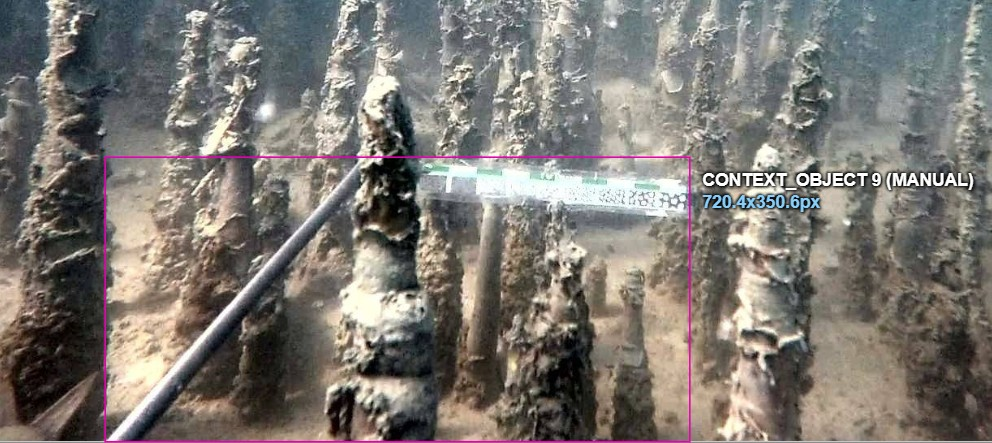 |
| *02_bbox — `CONTEXT_OBJECT 9`, the survey pole and scale bar. Every pneumatophore around it is natural structure and deliberately unannotated.* |
| **Image:** 02_bbox.jpg — `context_object`, and by implication every frame in the set |
| **Question:** Frames 1 and 2 are both full of mangrove root. In frame 2 I labelled the survey pole and its scale bar as `context_object` and labelled none of the roots, and I want to state why before I do it another eight times. The class is defined as "netting, cage structure, feed pellets or clouds, equipment, measurement markers" — every example is something a person put there. Roots are not on the list, but they are structure, they occlude fish, and someone reading the list quickly could reasonably call them structure. Which are they? |
| **My read:** Background. The line that makes the class coherent is **human-introduced versus naturally occurring**, not "structure versus not". Everything in the definition is gear. Roots, rocks, sediment and vegetation are the habitat the footage was shot in; labelling them would mean labelling most of the pixels in this dataset for no gain, and would make `context_object` mean two unrelated things at once. Where roots hide a fish, that is already recorded — on the fish, as `visibility`. |
| **Decision taken:** Natural habitat structure is background and is never annotated. `context_object` covers human-introduced objects only. Applied retroactively to frame 1, which has heavy root cover and correctly carries no `context_object` instances. |
| **Guideline gap?** **Yes.** v4.4 gives `context_object` by example rather than by principle, and the examples happen to be uniformly artificial without ever saying that is the criterion. On mangrove and reef footage that is a coin flip. Proposed for v4.5: *"`context_object` covers human-introduced objects only — gear, structure, instruments, markers. Naturally occurring structure such as roots, rock, coral or vegetation is background, however prominent. Where natural structure hides a fish, that is recorded on the fish as `visibility`, not as a separate object."* |

---

| **6.** |
| :---- |
| 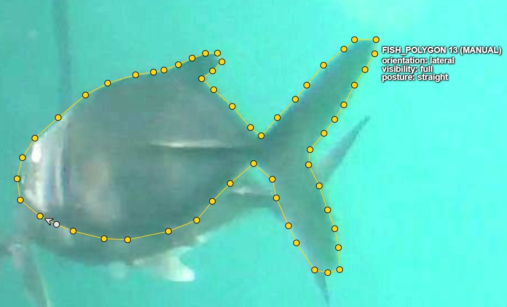 |
| *04_polygon — `FISH_POLYGON 13`, the *Caranx*, 57 vertices. Density follows curvature: dense at the caudal fork and the dorsal notch, sparse along the smooth flank.* |
| **Image:** 04_polygon.jpg — the large *Caranx*, upper right (`fish_polygon`) |
| **Question:** The guidelines set a vertex budget of 12 to 25 per fish. Tracing this one honestly took about 50. It has a deeply forked caudal, a notched and falcate second dorsal, and a curved ventral profile — every one of those is a direction change that needs a point. To come in under 25 I would have had to round off the caudal fork. Is my polygon over-traced, or is the budget wrong? |
| **My read:** The budget is wrong for this body type. 12 to 25 reads like it was written for a simple fusiform fish in flat profile, where most of the outline is two long smooth curves. It does not survive contact with a carangid. And cutting points to hit the number would have removed the fork, which is the single feature that makes a polygon worth more than a box here — so the budget, applied literally, would have destroyed the thing the annotation type exists to capture. |
| **Decision taken:** Kept roughly 50 vertices. Separately corrected a genuine defect in the first pass: about 18 points had piled up within a few pixels on the first dorsal from a slipped click. Those were waste, carried no shape, and were deleted. **Over-tracing and mis-clicking are not the same problem** — the first is a budget question, the second is a defect, and only the second was actually wrong here. |
| **Guideline gap?** **Yes.** Proposed for v4.6: *"Vertex density follows curvature, not a fixed count. Place points where the outline changes direction and leave straight runs bare. As an indication and not a cap: a simple fusiform fish in profile lands around 15 to 25; a deep-bodied fish with a forked caudal, falcate fins and a notched dorsal lands around 40 to 55. A shape that needs 50 points to trace honestly should get 50."* Worth adding the reason: under-vertexing to hit a budget shrinks the traced area, which silently inflates any area-derived measurement taken from the result — including the box-versus-polygon water fraction this project reports. |

---

| **7.** |
| :---- |
| 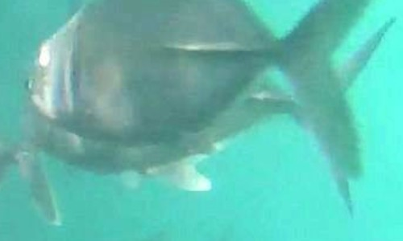 |
| *04_polygon — the instance lying behind the *Caranx*, shown unannotated. Declined under the boundary-ownership test: most of the outline available to trace belongs to the fish in front of it.* |
| **Image:** 04_polygon.jpg — the fish lying directly behind the large *Caranx* |
| **Question:** This fish is heavily occluded by the large *Caranx* in front of it. Only a strip of belly and part of the tail are visible. It is well above the size floor and I can read its orientation from the strip, so it arguably clears the threshold — `heavy_occlusion` exists as a value, which implies occluded fish are meant to be annotated rather than skipped. But when I started tracing it, most of the outline I was drawing was not this fish's edge. Does it get a polygon? |
| **My read:** No, and the threshold is not what rules it out. Occlusion and confidence are different axes: a fish 70% hidden can still show enough head and body line to carry all three attributes, and this one nearly does. **The problem is specific to polygons.** A polygon's whole value is its boundary, and most of the boundary here is the *other* fish's ventral edge — the line where this one disappears. Exporting that teaches a model that fish are shaped like the thing in front of them. A bounding box would have been fine, because a box only claims the animal is roughly within a region and that claim survives occlusion. A polygon makes a claim about shape, and this one would be confidently wrong rather than merely imprecise. |
| **Decision taken:** Not annotated. Counted below threshold for 04_polygon, with the reason recorded as occluder-dominated boundary rather than low confidence — they are different reasons and collapsing them would hide the finding. Also corrected `visibility: full` on the part-drawn instance before deleting it; that value contradicted the situation and would have been wrong under either outcome. |
| **Guideline gap?** **Yes, and it is a real one.** v4.6 states the threshold once and applies it identically to all four annotation types, but occlusion does not cost every type the same thing. Proposed for v4.7: *"For polygons and masks, apply a second test beyond the threshold: what fraction of the boundary you would trace belongs to the animal rather than to the occluder in front of it? Mostly animal — trace it and set `visibility: heavy_occlusion`. Mostly occluder — do not annotate it, and count it. A boundary that follows the occluder encodes the occluder's shape, which is a confident error rather than an imprecise one. Boxes are exempt: a box asserts location, not shape, and tolerates occlusion that a polygon cannot."* |

---

| **8.** |
| :---- |
| 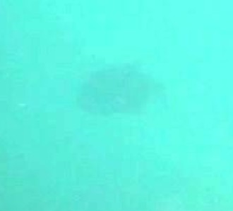 |
| *04_polygon — the dark patch, shown unannotated. Recognisable as an object, but no fin, tail, eye or edge at any zoom. Counted, not traced.* |
| **Image:** 04_polygon.jpg — a featureless dark patch deeper in the water column (traced, then deleted) |
| **Question:** A soft dark patch deeper in the water column. It is recognisably a fish and it is well above the size floor, but it has no resolvable edge anywhere — no fin margin, no tail fork, no eye. I traced a 13-point oval around it and gave it `lateral`, `full`, `straight`. Then I compared it to the rounded blur in frame 1, which was the same visual situation, and there I had correctly used `indeterminate`. Which of the two is right? |
| **My read:** Frame 1 was right and this was drift. Four frames in, on the annotation type where it costs the most, I applied a looser standard to the same kind of object without noticing. That is the error this batch was designed to detect, so finding it in my own work is the system doing its job rather than a reason to hide it. |
| **Decision taken:** Deleted. Counted below threshold. The reason recorded is **unresolvable boundary**, which is a third distinct reason from the two already in use — low attribute confidence, and occluder-dominated boundary from entry 7. |
| **Guideline gap?** **Yes,** and it completes the thought entry 7 started. Entry 7 established that a boundary tracing an occluder encodes the occluder's shape. A boundary drawn around a blur encodes nothing at all — it asserts a silhouette on no evidence. Both are confident errors rather than imprecise ones. Proposed for v4.8: *"A polygon requires a resolvable boundary, not merely a resolvable fish. Blur, depth and turbidity can leave an object clearly identifiable as a fish while removing the edge entirely. Where the outline would be estimated rather than observed, count the instance instead. This is independent of size: an instance can be well above the pixel floor and still have no boundary to trace."* |

---

| **9.** |
| :---- |
| 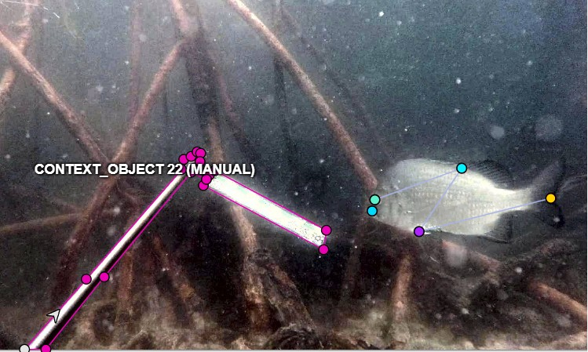 |
| *07_keypoint — `CONTEXT_OBJECT 22` as a polygon on a keypoint frame, alongside the fish skeleton. The image split governs `fish` only.* |
| **Image:** 07_keypoint.jpg — the survey pole and light assembly |
| **Question:** The image split assigns an annotation type to each frame, and I have been applying it to everything in the frame — boxes on the context objects in 02 and 03, polygons on them in 05 and 06. Frame 07 is a keypoint frame. Following that pattern means putting a five-point fish skeleton on a survey pole, with landmarks called `snout` and `tail_fork`. That is obviously wrong, but the guidelines do not say it is wrong, and the same problem arrives again on 08, 09 and 10. What does the frame's assigned type actually apply to? |
| **My read:** To `fish` only. The split exists to demonstrate four annotation types on the same subject across five completed image platforms, and the fish are that subject. `context_object` is scene information, not part of the comparison, so forcing it to follow the frame type serves nothing — and on a keypoint frame it produces an annotation with no meaning at all. I had been reading a rule about the *experiment* as a rule about the *frame*. |
| **Decision taken:** The image split governs the `fish` class only. `context_object` takes whatever shape bounds it sensibly, which for a thin diagonal pole assembly is a polygon — a box around one is mostly water, as noted back on 02. Frames 02 and 03 keep their boxes: a box is the frame's own assigned type there and is defensible on its own terms. Recorded as a documented inconsistency rather than corrected, because redoing them would change nothing about what the data shows. |
| **Guideline gap?** **Yes.** Proposed for v5.0: *"The image split assigns an annotation type per frame for the `fish` class only. `context_object` is not part of the type comparison and takes whatever shape bounds it sensibly — normally a polygon for thin or diagonal objects, a box for compact ones. A frame's assigned type never requires a geometrically meaningless annotation; where it appears to, the rule is being applied past its scope."* |

---

| **10.** |
| :---- |
| 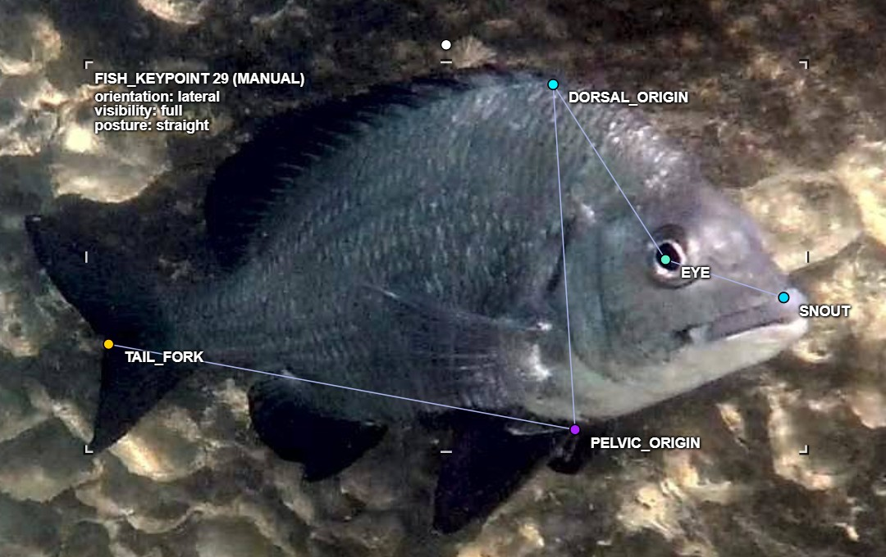 |
| *08_keypoint — `FISH_KEYPOINT 29`, all five landmarks after correction. `DORSAL_ORIGIN` at the first dorsal spine, `PELVIC_ORIGIN` on the anterior ventral fin.* |
| **Image:** 08_keypoint.jpg — the *Acanthopagrus* over rock; `dorsal_origin` and `pelvic_origin` |
| **Question:** Two of the five landmarks took three rounds to settle, for two different reasons. First, the guidelines define `dorsal_origin` as "where the dorsal fin meets the body, front edge" — I read that as anywhere along the fin base and placed it mid-fin, when the intended meaning is the fin's **anterior insertion**, the point nearest the snout where the first spine enters the body. Second, `pelvic_origin`: on this fish both ventral fins are black and sit in shadow, and I initially placed the point on the **anal** fin. Neither is a hard image — this fish is the best-lit in the whole set. So why did it take three passes? |
| **My read:** Because both failures are definitional, not visual. `origin` is an anatomical term of art and the gloss attached to it does not disambiguate it. And the five-point schema silently assumes the annotator can tell a pelvic fin from an anal fin, which is easy on a pale fish in good light and genuinely hard on a dark-finned sparid in shadow. Neither assumption is written down anywhere, so neither can be checked. |
| **Decision taken:** `dorsal_origin` moved forward to the first dorsal spine. `pelvic_origin` moved forward onto the anterior ventral fin. The final placement of `pelvic_origin` was **not independently verifiable at review resolution** — it was settled by the annotator, at full zoom, against a reviewer who could not see the fins any better. Recorded as accepted rather than confirmed. |
| **Guideline gap?** **Yes, two of them.** (1) Definition: proposed for v5.1 — *"`origin` means a fin's anterior insertion: the forwardmost point where the fin enters the body, nearest the snout. Not the centre of the fin base, and not the fin's highest point."* (2) Missing state: the schema has no way to record **identity uncertainty** about a landmark. The occluded flag does not cover it — the fin is plainly visible; what is uncertain is *which fin it is*. Same shape of gap as entry 3, where there was no value for turbidity. Proposed for v5.1 — a per-point `uncertain` flag distinct from `occluded`, with the caution that adding it mid-batch would break the drift comparison, so it belongs to the next batch. |

---

| **11.** |
| :---- |
| 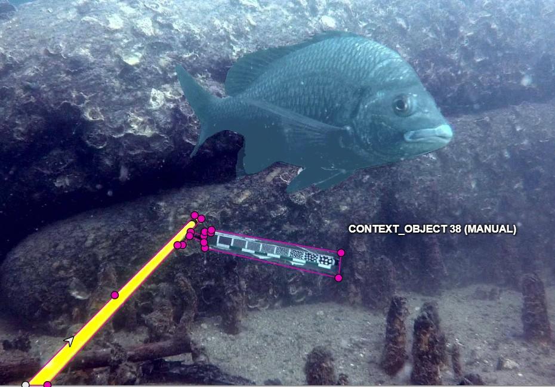 |
| *09_segmentation — `CONTEXT_OBJECT 38` with the fish mask visible. Annotated despite touching no fish, resolving the conflict with the old free-floating-equipment exemption.* |
| **Image:** 09_segmentation.jpg — the survey pole and scale bar |
| **Question:** Two rules in the guidelines point opposite ways here. The segmentation section says `context_object` is painted only where equipment overlaps or touches a fish, and that free-floating equipment elsewhere may be left as background. This pole touches nothing. But v5.0 decoupled `context_object` from the frame's annotation type, and I have annotated this same pole in every frame it appears — 02, 03, 05, 06, 07, 08. Skip it or annotate it? |
| **My read:** Annotate it. The §4.4 exemption was written on an assumption that no longer holds: that a `context_object` on a segmentation frame would have to be **painted as a mask**, which is slow and fiddly for a thin diagonal pole. That is why an escape hatch existed. v5.0 removed the assumption — the pole now gets a cheap polygon — but the exemption stayed behind after its reason had gone. A rule outliving its justification is exactly what a version bump is supposed to catch and this one slipped through. |
| **Decision taken:** Annotated as a polygon, consistent with 05 through 08. The deciding factor is consistency rather than either rule on its own: skipping it here would make `context_object` mean "annotated when convenient", which is worse for a downstream user than either a strict include or a strict exclude. |
| **Guideline gap?** **Yes — a stale rule rather than a missing one**, which is a different failure and arguably a more dangerous one, since it reads as deliberate. Proposed for v5.2: delete the free-floating-equipment exemption from the segmentation section entirely. Replace with — *"`context_object` is annotated wherever it appears, in every frame, using whatever shape bounds it sensibly. It is not conditional on proximity to a fish."* Also worth noting as process: this surfaced through the escalation criterion "two rules here appear to conflict", which is the first time that criterion has fired. |

---

| **12.** |
| :---- |
| 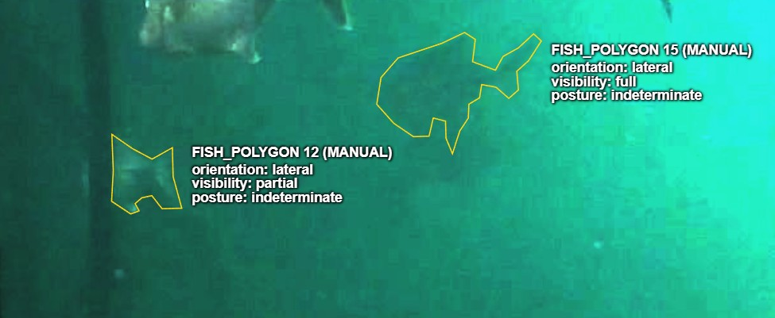 |
| *04_polygon: two faint fish reviewed at adjusted display settings. Both are poorly visible at default rendering and resolvable at the settings used for annotation.* |
| **Image:** 04_polygon.jpg — two faint instances deep in the water column. **This entry records a reviewer error, not an annotator one.** |
| **Question:** Two small, faint fish were traced using adjusted display settings. A review performed under different settings reported them as unsupported and recommended deletion. Were they invented? |
| **My read:** No. The review screenshots did not match the display settings used for annotation. At comparable settings, body, fin structure and an occluding root are visible. The review measured the rendering difference rather than the annotation. |
| **Decision taken:** Both kept. Attributes settled at `orientation: lateral`, `visibility: partial` (a root genuinely crosses them), `posture: indeterminate` — the body line is not readable well enough to claim `straight`, which is the same correction made in entry 2. The reviewer's objection was withdrawn. Recorded rather than quietly dropped, because **deleting work because it was challenged, rather than because it was wrong, is how good data gets destroyed.** |
| **Guideline gap?** **Yes, and it is about the review process rather than the annotation rules.** Proposed for v5.3: *"Review must be conducted at display settings comparable to those used for annotation. A reviewer working at a different brightness, contrast or gamma will generate false defects — reporting well-supported annotations as unsupported — and those false defects are expensive, because the natural response to a challenge is to delete. Where an annotation was produced using display adjustment, that fact is recorded with it so a reviewer knows to match it."* Also worth noting: this occurred **twice in the same frame**, and both times the reviewer's confidence was unaffected by being wrong the first time. |

| **13.** |
| :---- |
| *07_keypoint and 08_keypoint — `dorsal_origin` on both frames. **This entry was not produced by an annotator noticing something. It was produced by a measurement**, when the Supervisely run was compared landmark-by-landmark against the CVAT run.* |
| **Image:** 07_keypoint.jpg and 08_keypoint.jpg — the `dorsal_origin` landmark, both instances |
| **Question:** Ten landmarks were placed twice, 24 days apart, cold, on two different platforms by the same annotator. Four of the five landmark types reproduced within a few pixels. `dorsal_origin` did not. Is that a placement error, or does the guideline permit it? |
| **The measurement, which is the whole entry:** `eye` **2.5 px** · `tail_fork` **3.9 px** · `snout` **4.3 px** · `pelvic_origin` **5.6 px** · **`dorsal_origin` 13.8 px**. Mean of the other four: **4.1 px**. **`dorsal_origin` is 3.4x worse than the mean of its peers, and it is the worst landmark on BOTH frames independently** — 8.6 px on `07` and 19.0 px on `08`. Overall mean 6.0 px, median 4.2 px; as a share of fish span, 1.10% and 1.28%. |
| **My read:** Not a placement error. **It is the loosest definition in the schema.** `snout`, `eye` and `tail_fork` are points a second annotator can find without judgment — the tip, the pupil, the notch. `pelvic_origin` is anchored to a named fin. **`dorsal_origin` is defined as "at the first dorsal spine", and on a fish whose dorsal fin rises gradually from the body line there is no single pixel the phrase selects.** The spread is the definition's, not the hand's. |
| **Decision taken:** **The landmarks are kept as placed on both platforms. Nothing is re-placed to make the numbers agree** — that would be fitting the annotation to the measurement, which is the failure this whole document exists to avoid. **The finding is recorded as a guideline defect instead.** |
| **Guideline gap?** **Partly.** The Label Studio run weakened the original conclusion: `dorsal_origin` reproduced at 4.0 px, and all ten landmarks averaged 4.2 px. The Supervisely outlier remains measured, but one discrepant run and two agreeing runs do not prove the definition caused it. A clearer v5.4 wording remains proposed: place `dorsal_origin` where the leading edge of the first dorsal spine meets the dorsal body line. Practice across repeated runs remains a confound. |

---

**Four of these came out of frame 1 alone.** That is expected rather than alarming: frame 1 is the densest image in the set and the first one worked, so it is where the schema meets reality for the first time. Entries 2 and 3 are gaps the guidelines genuinely had. Entry 4 is closer to an error of my own — the rules covered it and I defaulted instead of reading. Both kinds belong here; conflating them would be the dishonest version of this document.

---

## How to write these

**Question** — ask it the way you would ask a client who has thirty seconds. State what you can see, what rule you think applies, and what specifically is unclear. Not "this image is hard."

**My read** — say what you think and why, before the decision. A reviewer can correct reasoning; they can't correct a verdict with no reasoning behind it.

**Decision taken** — what you actually did, and under which rule. If you invented a rule, say that plainly.

**Valid outcomes, all of them:**

- Resolved cleanly under an existing rule
- **Both labels acceptable** — the image genuinely sits on the boundary and either call is defensible. Say so rather than forcing a choice
- **Skipped** — image quality, angle or a deformity makes the correct label unknowable. Skipping is a decision, not a failure
- **Pending** — decided provisionally, flagged for review. Say what would change your mind

**Guideline gap** — yes only if a reasonable annotator following the version in force could have gone the other way. That is what makes it a gap rather than a mistake.

---

### Two worked examples

| **Example A** |
| :---- |
| **Image:** 05_polygon.jpg |
| **Question:** Two fish crossing, roughly the same size, one partly behind the other. The overlap is about 70%. The guidelines say overlapping fish get one annotation each, but they don't say whether the rear fish still counts as a separate instance when this much of it is hidden. Should this be two polygons or one? |
| **My read:** Two. Both heads are independently visible, so both are individually identifiable, and the rule about tracing only the visible outline already covers how to handle the hidden part. |
| **Decision taken:** Two polygons, rear fish `visibility: heavy_occlusion`. |
| **Guideline gap?** No. Existing rules cover it, just not in one place. |

| **Example B** |
| :---- |
| **Image:** 02_bbox.jpg |
| **Question:** Fish entering the frame at the right edge, only the tail visible. It is clearly a fish and it is above the size minimum, but there is no body line, so posture can't be read. The threshold rule says skip anything where all three attributes can't be assigned. The edge-crop rule says annotate it with `visibility: partial`. These two rules point opposite ways. |
| **My read:** Annotate it. `posture: indeterminate` exists as a value, so the attribute *can* be assigned, it just isn't informative. The threshold is about not inventing values, and `indeterminate` isn't invented. |
| **Decision taken:** Annotated. `visibility: partial`, `posture: indeterminate`. Flagged as pending — a reviewer might reasonably prefer the skip. |
| **Guideline gap?** **Yes.** v4.1 doesn't say whether `indeterminate` counts as satisfying the threshold. Proposed wording for v4.2: *"An attribute set to `indeterminate` satisfies the threshold, provided the value reflects a genuine limit of the image rather than annotator uncertainty."* |

Example B is the valuable kind. It finds a real conflict between two rules, resolves it with reasoning, and produces wording that would prevent the next annotator hitting it.

---

## Part 2 — Polygon versus bounding box: the measurement

Two fish, two frames. Areas computed by shoelace from exported Datumaro vertices, not estimated. Instances are identified by frame and species rather than by CVAT instance number — see the note on identifier stability below. In both cases the **box was drawn before the polygon**, so no box was snapped to a traced outline.

| | **04_polygon** — *Caranx* (jack) | **06_polygon** — *Acanthopagrus* (bream) |
|---|---|---|
| Polygon vertices | 57 | 33 |
| Polygon area | 32,527 px² | 60,540 px² |
| Hand-drawn box | 67,990 px² (323.3 × 210.3) | 89,182 px² (382.1 × 233.4) |
| Tight box from polygon | 67,585 px² | 88,798 px² |
| Box aspect ratio (w/h) | 1.54 | 1.64 |
| **Water fraction (hand box)** | **52.2%** | **32.1%** |
| Water fraction (tight box) | 51.9% | 31.8% |
| Box padding over optimal | 0.60% | 0.43% |

### Finding 1 — the wasted area is a property of body plan, not pose

Both fish are near-lateral and their boxes have almost the same aspect ratio (1.54 and 1.64), so pose is effectively controlled. The gap between them is **twenty percentage points**, and it comes from morphology:

- The **jack** is a streamlined body carrying long thin appendages — a deeply forked caudal whose V is a large void inside the box, plus falcate dorsal and anal lobes that extend the rectangle without adding area.
- The **bream** is a laterally compressed disc with a shallow caudal fork. A disc fills a rectangle efficiently almost by definition.

**The practical consequence: box-area error is species-dependent.** Anyone estimating length, biomass or condition from bounding-box area across mixed footage cannot apply one correction factor — the bias on carangids is roughly 1.6× the bias on sparids in the same frames, at the same pose. That is the argument for polygons on this data, and it is a sharper one than any single average would have supported.

### Finding 2 — the box is not the problem

Both hand-drawn boxes landed within **0.6% and 0.43%** of the geometrically optimal box, sub-pixel on every edge, drawn independently and on different days. So neither figure reflects careless boxing. The waste is the axis-aligned rectangle being the wrong primitive for these shapes, and no amount of annotator care recovers it. Training an annotator harder fixes the first kind of error and cannot touch the second.

### Robustness note

The bream carries 33 vertices to the jack's 57. Fewer vertices *shrink* a traced area, which *raises* the computed water fraction — so under-tracing would have pushed the bream's number up, toward the jack's. It came out twenty points lower regardless. **The gap is if anything understated**, which is the direction that matters when the result is one you'd like to be true.

### What was not tested

The sample contained **no elongated fish at a steep angle**. Both measurements are near-lateral, so the pose-dependence of the water fraction remains open and is not claimed either way. n = 2.

---

## A note on instance identifiers

**CVAT's displayed instance number is a position in the job's object list, not a stable identifier.** Deleting any object renumbers every object after it. Over this run four objects were deleted — two declined polygons, and two temporary measurement boxes — and every later instance shifted down by four accordingly.

Everything in this log therefore refers to instances by **frame plus description** (species, position, or dimensions), which survives renumbering. Final instance numbers, if wanted, should be read off the last export rather than any intermediate one.

This is worth stating rather than silently working around, because a log that cites instance numbers captured mid-run will quietly stop pointing at anything, and nothing in the tool warns you.

---

## Part 3 — Below-threshold counts

Per the threshold rule, fish that can't carry all three attributes aren't annotated. Count them instead. This tells a downstream team what share of each frame their model will never learn from.

**Two different exclusions, and only one belongs in this column.** A shape known to be a fish but unreadable is below threshold and is counted. A shape whose identity cannot be established is not counted, because this figure is meant to tell a downstream team how much *fish* their model will never learn from — mixing in possible netting or root makes it unusable for that. Where the second kind occurs, it goes in the Note column instead.

| Image | Annotated | Below threshold (approx) | Note |
|---|---|---|---|
| 01_bbox | 7 | 2 | Both below-threshold shapes are recognisably fish but sit too deep in the water column to carry orientation or posture. A brownish object on the substrate was examined and identified as **rock with surface reflection** — background, nothing recorded. A third shape at the right frame border is **excluded rather than counted**: I could not establish it is a fish at all, and counting shapes of uncertain identity would inflate this column with structure. |
| 02_bbox | 1 | 0 | Sparse frame: one annotatable fish, one `context_object` (survey pole and scale bar). Dense pneumatophore cover throughout, all background per entry 5. One small pale shape on the substrate examined at zoom and identified as debris, so background rather than an exclusion — nothing to record. |
| 03_bbox | 1 | 0 | One large, sharp `lateral` instance — the clearest fish in the set. One dark mass below it examined at zoom and identified as rock. Background beyond the substrate is a uniform turbid wall and fails threshold on sight; nothing there is countable as fish. One `context_object`: survey pole and scale bar boxed as a single assembly, matching frame 2. They are one instrument, and splitting them would have made the two frames inconsistent for no gain. |
| 04_polygon | 4 | 2 | Four polygons: the large *Caranx*, the smaller fish ahead of it, and two faint instances deeper in the column, both traced at adjusted gamma and both carrying `posture: indeterminate` (entries 2 and 12). A further dark rounded shape on the right of the frame was examined at adjusted gamma and **excluded rather than counted** — no fin, tail, eye or body line, so its identity as a fish was never established. Two excluded for **different** reasons and counted separately — the fish behind the *Caranx* under the boundary-ownership test (entry 7, occluder-dominated), and the featureless patch under the resolvable-boundary rule (entry 8, blur). Neither was a confidence failure in the original sense. Adjust the count if further faint shapes were tallied. |
| 05_polygon | 3 | 0 | Three fish: the truncated jack at right, and the two mutually occluding bream at centre and left. **No instance in this frame is `visibility: full`**, for three distinct reasons: the jack truncated at the right frame edge, the two bream mutually occluding. The left bream's rear boundary follows the occluder for roughly a quarter of its outline and passes the ownership test. One `context_object`: yellow survey pole, its clamp, and the light head, traced as one assembly — same treatment as the pole and scale bar in frames 2 and 3. |
| 06_polygon | 1 | 0 | Single *Acanthopagrus*, clean and unoccluded — the second of the two water-fraction measurements. One `context_object`: yellow pole, clamp and light head as one assembly. Measurement bounding box deleted after export. |
| 07_keypoint | 1 | 0 | Single *Acanthopagrus*, five-point skeleton, all landmarks visible and none inferred. The caudal fin sits dark against a dark background and `tail_fork` was initially placed on the peduncle; corrected after tracing the fin outline to locate the notch. One `context_object`: pole and light bar as a polygon, truncated at the lower frame edge — the first frame where the context object does **not** follow the frame's assigned type (entry 9). Right side of the frame is turbid and holds nothing countable. |
| 08_keypoint | 1 | 0 | Single *Acanthopagrus* over rock, the best-lit fish in the set. Five landmarks, none inferred, none occluded. `dorsal_origin` and `pelvic_origin` each required correction — see entry 10; the final `pelvic_origin` placement is accepted on the annotator's judgment at full zoom and was not independently verifiable at review resolution. One `context_object`: pole and scale bar, polygon per entry 9. |
| 09_segmentation | 1 | 0 | Single *Acanthopagrus* against rock. **Manual mask, 11 min 41 s — first segmentation ever attempted**, after a familiarisation pass on 03_bbox that was deleted. Costliest regions were the dark dorsal edge against dark rock, and the fin margins; both were treated consistently rather than perfected, on the grounds that an unrepeatable edge is not precision. One `context_object`: pole and scale bar, polygon per entries 9 and 11. |
| 10_segmentation | 1 | 0 | Single fish against pale substrate — the easy frame, and the reason the cross-frame speed comparison was discarded in favour of running SAM on 09 as well. **SAM 3 one-shot, 52 s, no corrections identified.** One `context_object`: pole, clamp and light head. |

---

## Part 4 - Verification pass

Verification was performed against exports. Unknowns remain explicit.

| Check | CVAT | Roboflow | Supervisely | Label Studio | Labelbox |
| --- | --- | --- | --- | --- | --- |
| Missing attributes | 0 of 22 | n/a, attributes unsupported | 0 of 22 | 0 of 29 fish-class regions | 0 of 19 fish objects |
| Counts | 10 images, 30 records | 5 images, 14 records | 10 images, 30 objects | 10 images, 37 regions | 10 images, 37 normalized objects |
| Cross-attribute constraint | 0 violations | n/a | 0 violations | 0 violations | 0 axial-plus-straight violations |
| Keypoint completeness | 2 skeletons, 10 landmarks | not run | 2 graphs, 10 named nodes | 10 flat landmarks; transient duplicate/missing identity corrected before final export | 10 flat landmarks; identity complete, grouping unavailable |
| Export fidelity | Datumaro complete; COCO drops 2 skeletons | Geometry complete; 6 package defects | Native export complete | Native export complete | NDJSON complete against normalized CVAT counts; two masks downloaded locally |
| Export freshness | Stale cache observed | Export cache not observed; public page was stale | No stale output observed across 5 exports; absence not proved | One export only, untested | One export only; caching untested |

### CVAT verification notes

**Final delivered state: 22 fish instances, 8 context objects, 30 annotations across 10 frames.** All eight checks below were run in code against the delivered Datumaro export — not by eye.

> **CORRECTED 29 August 2026.** This paragraph named the private history file `CVAT exports/history/cvat_fish_run_2026-08-06_DATUMARO.zip`, MD5 `dd0da750…`. **The delivered file is `CVAT exports/cvat_fish_run_2026-08-06_FINAL_DATUMARO.zip`, MD5 `d8bdc3b46674363c95dee5a2911740c6`.**
>
> **The cited file was not lost. It is retained in the private `CVAT exports/history/` directory**, and the two were diffed annotation by annotation on 29 August. **They differ by exactly one value.** Both hold 30 annotations across 10 images with identical geometry; **one `fish_polygon` on `04_polygon` carries `posture: straight` in the cited export and `posture: indeterminate` in the delivered one.**
>
> **That single change is why the distribution below reads `straight 15 / indeterminate 7`. The cited file reads `16 / 6`.** **The published figures describe the delivered artifact, which is correct** - but the paragraph named the wrong file to check them against. **It is also, in all likelihood, the "attribute drift: 1 found, corrected" row of the verification table, caught between two exports and visible now only because both were kept.**
>
> **The checks were re-run against the delivered file on 29 August and all pass:** 10 images, 30 annotations, 22 fish instances, **0 missing attributes**, **0 cross-attribute violations**, **0 undersized**, class counts `fish_bbox` 9 · `fish_polygon` 8 · `fish_mask` 3 · `fish_keypoint` 2 · `context_object` 8, and the attribute distribution below reproduced exactly.

| Check | Result |
|---|---|
| Attribute completeness | 0 / 22 missing |
| `orientation: axial` implies `posture: indeterminate` | 0 violations |
| Minimum 12 x 12 px | 0 |
| Correct fish class per frame | 0 errors |
| Self-intersecting polygons | 0 |
| Skeletons carrying all 5 points | 0 errors |
| `context_object` present on every frame containing gear | 0 missing |
| Mask overlap | 1 **deliberate** exception |

Final attribute distribution: `orientation` lateral 17 / axial 4 / indeterminate 1 — `visibility` full 18 / partial 4 — `posture` straight 15 / indeterminate 7.

**A stale export was caught before delivery.** An earlier file requested as the final one came back byte-identical to an export two rounds old, because CVAT caches by task and format rather than by filename. Had it shipped, every check above would have passed against a dataset that no longer existed. Details in the platform comparison log.

**Checks 1 to 5 and the cross-attribute constraint were run programmatically** against the exported Datumaro file rather than by eye — 22 fish instances parsed, attributes and geometry checked in code. That makes them evidence rather than assertion, and it is the reason they can be reported as exact counts.

**Mask overlap — deliberate exception.** 09_segmentation carries two `fish_mask` objects sharing 170,863 px. These are the manual and SAM 3 masks of the same fish, retained together so the agreement analysis can be reproduced from the export. This violates the no-overlap rule knowingly. Any downstream consumer taking this frame as semantic segmentation should use the manual mask alone.

**Occluded flags — rule never exercised.** Both keypoint frames had all five landmarks plainly visible, so no point was ever flagged occluded. The rule requiring hidden landmarks to be placed at inferred positions and flagged is therefore **written but untested**. It is not validated by this batch and should not be reported as if it were.

**Rendered geometry pass.** Every shape was re-checked numerically against the final export — vertex spacing, self-intersection, edge lengths, minimum size, skeleton point order and landmark proportions — and annotations were re-rendered over the source images at stated display settings (brightness x1.45, contrast x1.15) rather than judged from session screenshots. This was a direct response to entry 12.

It found one defect: a **7 x 33 px polygon on 04_polygon**, a sliver of a fish visible on the far side of a root. Deleted — it fell below the 12 px floor, and it could not be merged with its parent instance because a polygon is a single closed ring and an instance split in two by an occluder needs two.

**Skeleton cross-check — raised and cleared.** The two skeletons place `dorsal_origin` at 48.8% and 65.8% of body length from the tail, and put the eye at 7% and 18% of body length from the snout. The measure is direction-normalised, so facing direction does not explain it. Both fish were re-examined at raised brightness: `snout` sits on the head in both, and no landmark is displaced. **The cause is morphology** — 07 is an elongate fish, 08 a deep-bodied sparid — and the schema has no species field to make that legible. Recorded because a numeric flag that is investigated and cleared is a result, not a non-event, and because the same 17-point spread in a batch of one species would have been a defect.

**Unused attribute values, stated rather than hidden.**

- `posture` never took the value **`curved`** — **15 straight, 7 indeterminate**. Every fish encountered was cruising or unreadable. The value is plausible but unexercised.
- `visibility` never took the value **`heavy_occlusion`** — **18 full, 4 partial**. This one is self-consistent rather than accidental: entry 7's boundary-ownership test routes heavily occluded instances to the count rather than to an annotation, so on a set with no bbox-frame heavy occlusions the value has no way to appear.

An unused schema value looks like an oversight unless the reason is given. One of these has a reason; the other is simply an absence in the data.

**Attribute drift is the row that matters.** It is the error volume produces, it is invisible unless you look for it deliberately, and catching it is the difference between someone who labels and someone who runs quality.

It should also vary between platforms. Tools that constrain attribute values to a fixed list should show near-zero drift; tools with free-text attributes should show more. If that turns out wrong, say so — a disproven expectation is a better finding than a confirmed one.

---

## Part 5 - Batch summary

|  | CVAT | Roboflow | Supervisely | Label Studio | Labelbox |
| --- | --- | --- | --- | --- | --- |
| Images done | 10 | 5, fixed polygon/mask subset | 10 | 10 | 10 |
| Bounding boxes | 9 fish | not run | 9 fish | 9 fish | 9 fish |
| Fish polygons | 8 | 8 | 8 | 8 | 8 |
| Keypoints | 2 skeletons, 10 landmarks | not run | 2 graphs, 10 nodes | 10 flat points | 10 flat points, no parent skeleton |
| Segmentation | 3 masks, including manual/assisted pair | 2 regions drawn as polygons | 3 masks, including manual/assisted pair | 2 masks | 2 masks |
| Context objects | 8 | 4 | 8 | 8 | 8 |
| Total records | 30 | 14 | 30 | 37 | 37 normalized objects |
| Comparable attribute result | baseline | unsupported | 66 of 66; independently 63 of 63 outside supplied frame 03 | 87 of 87 | 57 of 57 required values present; cross-platform value equality not re-derived |
| New edge-case effect | 12 initial entries | no new annotation case | entry 13 created from landmark measurement | entry 13 conclusion weakened by third run | Required attributes not enforced; point grouping unavailable; mask URLs require separate delivery |
| Verification result | complete | complete with 6 package defects | complete | complete; transient landmark error corrected | complete; current verifier parses the retained CVAT Datumaro archive; self-review only |
| Status | complete | complete | complete | complete | complete |

Across the five completed image-platform runs, the data supports repeatability for the same annotator. It does not measure inter-annotator agreement. The image milestone closed on 7 September 2026. CVAT video completed on 8 September and is documented below. Text closed on 10 September: 22 abstracts, 405 spans. Audio closed on 15 September: 12 clips, 323 regions and 1,185 records.

---

# Video run: CVAT fish tracking, 8 September 2026

Six tracks, 762 manually placed visible boxes, 300 frame items at 29.97 fps. Log Track N maps to export ID N-1. Video entries are numbered 14 and 15 to preserve the existing image Entry 13.

## Entry 14: motion can preserve location when attributes are unreadable

Track 1 has 125 frames, f136-f260, with orientation `indeterminate`, visibility `heavy_occlusion`, and posture `indeterminate`. The annotator reports that tail movement kept the fish locatable while orientation and posture became unreadable. The source's wording that all three attributes were indeterminate was incorrect.

The source also reports a reviewer using sampled stills could not resolve later track portions. Sampled stills cannot independently prove identity sustained by motion. Motion can support location; it does not by itself justify identity across a gap or readable orientation/posture.

**Proposed, not adopted:** distinguish locatable from describable instances and record which anatomical region prevents an attribute decision. The run remains documented under guidelines v6.0.

## Entry 15: inspect the delivered tracking file

The source reports an unterminated Track 1 in an earlier checkpoint after confusion between occluded and outside controls. The retained final has an outside marker at f261. Both supplied checkpoint archives equal the finals and cannot reproduce the earlier defect.

The source's 119-excess-box claim remains unresolved: f20-f299 has 280 active frames, the final f20-f260 has 241, a difference of 39. No earlier artifact supporting 119 was supplied. It is not a verified defect count.

**Proposed, not adopted:** read exported track spans, terminators, attributes, and flags before delivery. Editor appearance and export integrity are separate checks.

## Reported final review and recalculated risk zones

| Check | Result and evidence boundary |
|---|---|
| Tracks 1/2 | 37 frames with IoU > 0.15 within f115-f157, peak 0.2484 at f138. The supplied log reports frame-by-frame identity review. The full interval has 43 frames; 37 is the threshold-qualified count. |
| Tracks 2/3 | 13 frames with IoU > 0.15 within f268-f280, peak 0.3150 at f276. The log reports frame-by-frame identity review. |
| Fragmentation | The annotator catalogued 13 fish and tracked six, reporting no repeated individual among the six IDs. This is a reported review outcome. |
| Track 6 location | The export and sampled video place it at lower-right, x=483.7 to 720 at f277. The incoming lower-left description was corrected. |
| Continuous spans | All six active spans are continuous in both exports. Tracks 1, 2, and 4 terminate at f261, f283, and f266; Tracks 3, 5, and 6 continue through f299. |
| Attribute drift | The review reports checking every track. All twenty logged ranges match the exports; matching ranges do not independently prove semantic correctness. |
| Outside placement | The review reports the three fish leave. The exports verify markers; sampled stills do not independently establish every endpoint's motion or visibility. |
| Final-review corrections | Zero reported. Separate from the earlier checkpoint correction; not a zero-error accuracy claim. |
| Interpolation | Not exercised; manual placement throughout. No interpolation error percentage is claimed. |

## Seven excluded instances, reported by the annotator

| Instance | Frames | Observation | Recorded reason |
|---|---|---|---|
| 7 | f0-f56 | Body briefly readable; head unreadable, then disappears | Unresolvable boundary |
| 8 | f0-f134 | Similar to 7, longer on screen and above it | Unresolvable boundary |
| 9 | f24-f38 | Unreadable in murk | Unresolvable boundary |
| 10 | f0-f82 | Partial body, no readable head; reported occlusion by the animal later tracked as Track 2 | Occluder-dominated boundary |
| 11 | f79-f172 | Partial body, no readable head; reported overlap with Tracks 1 and 2, then loss in murk | Occluder-dominated, then unresolvable |
| 12 | f278-f299 | Snout and face readable, body unreadable | Insufficient attributes |
| 13 | f278-f299 | Unreadable in murk, left of instance 12 | Unresolvable boundary |

Final reported split: **4 unresolvable, 2 occluder-dominated, 1 insufficient attributes**. The earlier unsplit note is superseded. Unannotated fish identities and spans cannot be independently reconstructed from the six-track export. Instance 10 ends before Track 2's annotated span starts at f84; its exact occlusion timing is not verified by the export.

The annotator describes six head-unreadable exclusions and one body-unreadable exclusion with a readable head. This suggests a useful head/body distinction for this clip; it does not establish downstream model performance. Proposed v6.1 guidance remains a proposal.

## Text and audio delivery decisions, 15 September 2026

Both modalities are closed. [The case studies](MODALITY_CASE_STUDIES.md) document percentage-span boundaries, scoped attributes, backchannels versus overlap, silence versus audible non-speech, and unintended parent links. The final audio silence-split convention is 1.5 seconds; earlier thresholds are superseded.

## Video consumer notes, 15 September 2026

The visibility attribute, not CVAT's standard occluded flag, records occlusion in this delivery. Of 762 visible boxes, 162 are full, 387 partial and 213 heavy_occlusion. Three additional records are outside terminators. The declared context_object label has no instances.

A sudden box-size change is a review flag, not proof of a tracking failure: occlusion and frame exits can legitimately shrink visible geometry. Review frames and attributes together. See [video provenance](VIDEO_SOURCE_PROVENANCE.txt).
