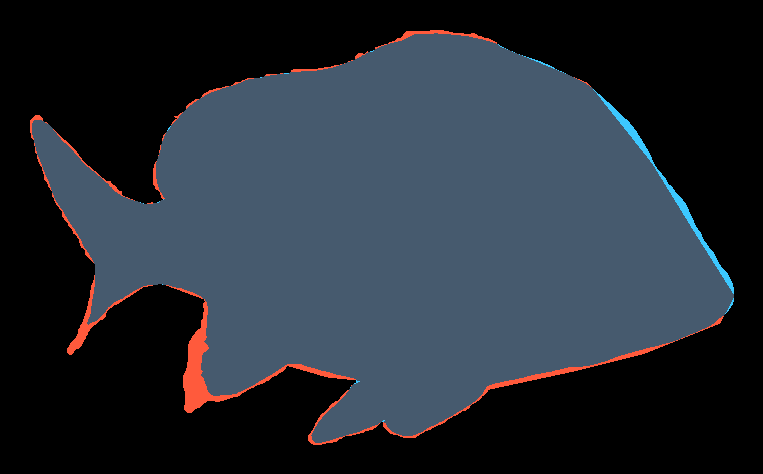

# Platform Comparison Log

> ## STATUS, 8 September 2026
>
> **Completed image runs:** CVAT on ten images, Roboflow on the fixed five-image polygon and mask subset, Supervisely on ten images, Label Studio on ten images, and Labelbox on ten images.
>
> **Excluded:** SuperAnnotate was not used and was removed from portfolio scope. It is not pending and is not claimable.
>
> Evidence tags remain: `[measured]`, `[obs]`, `[present, untested]`, `[unknown]`, and `[rated]`.

Same ten-image design, same current guidelines, same annotator. Five completed image platforms; Roboflow is the documented five-image exception.
Fill each column immediately after finishing that platform, while the friction is still fresh.

> ## ⚠ TIER MISMATCH, recorded 26 August 2026. Read before comparing column to column.
>
> **CVAT was run on the free tier. Roboflow auto-enrolled a new account into a 14-day Premium Trial**
> — private data, no dataset size limit, 10x augmentations, **Review Mode**, **Labeling History**,
> role-based access control, 15 credits.
>
> **These columns are therefore not like-for-like on anything tier-dependent**, and Section A's
> *"free tier limits that actually bit"* row **cannot be answered for Roboflow at all**: on a premium
> trial they do not bite. **Say that in the cell rather than writing "none".**
>
> **The trial is itself a finding worth stating in the verdict:** *a first-time evaluator of Roboflow
> does not see the free tier. Fourteen days of premium is what shapes the impression, and the tool a
> team would actually be given on day fifteen was never the tool under evaluation.*
>
> **Mark every Roboflow row that depends on the tier with `[premium trial]`.** In particular
> **Review Mode and Labeling History are premium-gated** — which maps directly onto Section C, where
> CVAT offers stages, assignees and Issues **on its free tier.** That contrast is a real finding and
> it is the opposite of what the raw feature list suggests.
>
> **Export everything before the trial ends.** Fourteen days from 26 August is **9 September.**
>
> **The CVAT cells below are summaries.** The full reasoning, with the basis stated for every row,
> lives once in **"The CVAT questionnaire"** further down. **Do not restate it here — the matrix is
> for scanning and comparing; the questionnaire is for the argument.**

---

## ⚑ ROBOFLOW, STRUCTURAL FINDING — one annotation type per project. Recorded 26 August 2026.

**Roboflow forces a single Project Type at creation and the types are mutually exclusive:**
Object Detection · Classification · **Instance Segmentation** · **Keypoint Detection** · Multimodal ·
Semantic Segmentation.

**This portfolio puts four annotation types on the same ten images. Roboflow cannot hold that in one
project.** Doing the full set would require **four separate projects, four separate Universe URLs and
four separate schemas, with no shared label set and no way to view one image's four treatments
together.**

**CVAT held all four in a single task under one label definition.**

**This is a larger finding than the missing per-instance attributes**, and it is decision-relevant in
a way a feature list is not: **a team standardising on Roboflow cannot keep one dataset with mixed
annotation types. They must fragment by type, and schema consistency across those fragments becomes
manual discipline.** Exactly the same failure mode as CVAT's free-tier project cap, arriving by a
different route.

**Decision taken for this run: one project, Instance Segmentation.** Polygons are the higher-skill
demonstration and carry the eight polygon frames plus the three mask frames — `fish_mask` was already
a forced compromise to polygon on this platform. **Bounding boxes and keypoints are not demonstrated
on Roboflow, and that absence is the finding, not an omission.**

### Roboflow, second structural finding — instance model versus class-level regions

**Roboflow's in-product guidance states: *"A single polygon should represent a single instance of a
subject."*** That is correct for instance segmentation and it **directly contradicts this project's
own mask rule**, which is class-level:

> *"This is class-level, not instance-level. Two touching fish form one continuous `fish` region.
> Do not attempt to separate them."* — `annotation_guidelines_v4.md`

**So `09_segmentation` and `10_segmentation` do not belong in an Instance Segmentation project at
all.** They were annotated in CVAT as continuous class-level regions. Placing them here forces a
choice between **splitting a region that was deliberately not split** — changing the data to suit the
tool — or **drawing it as CVAT did and violating Roboflow's own instance model.**

**Roboflow does offer a Semantic Segmentation project type. It is a different project.** So the
honest count for this portfolio on Roboflow is now **four projects, not one**: Object Detection for
the bbox frames, Instance Segmentation for the polygon frames, Keypoint Detection for the skeleton
frames, **and Semantic Segmentation for the mask frames.**

**Decision taken: the two mask frames are annotated as CVAT annotated them — continuous class-level
regions — and the violation of Roboflow's instance model is recorded rather than hidden.** Changing
the annotation to suit the platform would make the comparison measure the accommodation instead of
the platform.

### Roboflow, third finding — a default class is created from the project name and applied silently

**On `04_polygon.jpg`, the first four polygons drawn were all assigned to a class called
`aquaculture-fish-segmentation` — the project name.** No class was chosen, none was prompted for, and
nothing warned that every shape was landing in one auto-created bucket.

**CVAT cannot do this.** A label must exist before a shape can be drawn, because the shape type is
bound to the label definition. **Roboflow lets you annotate first and sort it out later, which is
faster and is exactly how a single-class dataset gets built by accident.**

**Roboflow does provide a guard: a `Lock Classes` checkbox on the Classes & Tags page, which prevents new classes being created during annotation. It is off by default.** So the trap is opt-out rather than absent, which is fairer to the platform than the first draft of this finding implied.

**Severity is low if caught on image one and high if caught on image five** — by then the fix is
re-classing every annotation in the batch rather than four. **Caught here on image one.**

**For the verdict: this is the same product posture showing up a third time.** Auto Label as the
default path, Smart Select recommended, train-early advice, and now a schema that materialises itself
rather than being declared. **Roboflow optimises for getting to a model quickly. Every one of those
choices trades schema discipline for speed**, and schema discipline is the thing this portfolio was
built to demonstrate.

### Roboflow, fourth finding — annotating an image does not put it in the dataset

**`04_polygon` and `05_polygon` were both annotated. The Dataset view showed `1 - 1 of 1`.**
**Annotation and dataset membership are separate states**, with an approval step between them, and
**an export draws from the Dataset, not from the annotation queue.**

**The failure mode is silent and it is severe:** finish all five frames, export, and receive a file
containing whatever happened to be approved. **Nothing warns you.** CVAT has no equivalent gap —
a task's annotations are the task's annotations, and export takes what is there.

**Check dataset membership before exporting, not after.**

### Roboflow, sixth finding — the "annotated" flag is not derived from whether annotations exist

**Directly observed, 26 August 2026, and this one is a data-integrity problem rather than a friction
point.**

`04_polygon.jpg` **carries four `fish_polygon` annotations, visible in the Layers panel.** The job
panel lists it under **Unannotated**. **A file with four committed shapes is flagged as having none.**

~~**The same panel reports "3 Annotated" in a four-image job whose other three members have not been
touched.**~~ **WRONG, corrected the same hour. `06_polygon`, `09_segmentation` and `10_segmentation`
had all been annotated; the "3 Annotated" count was accurate.** The error was Claude's: it inferred
those frames were untouched because it had not been shown them, and **treated absence of evidence in
its own view as evidence of absence in the world.**

**So the finding is narrower than first written, and the narrow version is still real: one image,
`04_polygon`, holds four committed annotations and is flagged Unannotated.**

**Whatever the flag tracks, it is not purely the presence of annotations** — four shapes exist on a
frame reported as having none. **The mechanism was not determined and should not be guessed at.**

**Why it matters:** dataset membership and export both key off job and image status. **An image can
hold finished work and still be treated as empty**, and if that status governs what reaches the
export, the work is silently dropped. **One frame in five, on a first run, found only by opening the
image.**

**Mitigation, and it is not optional on this platform: verify image by image before export. Do not
trust the progress bar, the Annotated/Unannotated tabs, or the job counts.**

**CVAT's equivalent claim is weaker but honest — its instance numbers renumber and its exports cache,
both of which this project already documented. Neither of those misreports whether work exists.**

> **Credit note, corrected 26 Aug.** The Create-New-Version button is labelled **"Uses Credits"**, but
> the workspace still read **0 / 15** after v1 was generated. **Version generation did not consume a
> credit; the label appears to apply to training.** An earlier claim that dataset versions are
> credit-metered was wrong and is withdrawn.

### Roboflow, fifth finding — a dataset cannot exist without a training split

The dataset view offers **Change Dataset Split**, and Roboflow assigns train / valid / test whether
or not the data is for training. **On five images the partition is meaningless** — three, one and one,
or similar — **but it is not optional.**

**CVAT has no concept of a train/validation split**, because CVAT is an annotation tool and the split
belongs to whoever trains the model. **On Roboflow it is structural: the unit of work is a training
dataset, not an annotation job.**

**That is the same product posture as the auto-label default and the self-materialising schema, but
embedded in the data model rather than in the UI.** It is the strongest single piece of evidence for
the verdict line: **Roboflow is a dataset pipeline that includes an annotation tool; CVAT is an
annotation tool.**

### Roboflow product posture — a verdict-level observation

Three separate signals in the first ten minutes, all pointing the same way:
**the default labelling path is Auto Label**, presented as *"Fastest"* with manual second ·
the in-product tips recommend **"Use our Smart Select tool"** · and **"Train a model early (after
~50 labeled images) to use Model Evaluation and Auto Label for faster labeling."**

**Roboflow assumes the user is the model owner, not a contract annotator.** CVAT hands you an
annotation tool; **Roboflow hands you a pipeline in which manual annotation is the cold-start cost to
be eliminated.** Neither posture is wrong. **They are aimed at different people, and only one of them
is aimed at the person doing the labelling.**

### Roboflow, seventh finding — the description editor was not locatable, and the platform's own agent was working from outdated documentation

> **RESOLVED 27 August 2026, and the heading was corrected at the same time.** This finding
> originally read *"the public description cannot be edited."* **That claim was too strong: the
> editor exists and the description is now published.** What the evidence below actually supports is
> that the control could not be found from the places a user would look, and that Roboflow's own
> assistant sent the user to an interface that no longer exists. **That part stands unchanged.**
> Resolution and two follow-on observations are at the end of this entry.

**26 August 2026. The Universe page reads "A description for this project has not been published
yet." The editor was not locatable.**

Checked: the workspace-card **⋮** menu (Copy Project Id, Move, Duplicate, Copy Images, Merge, Rename,
Change Owner, Make Private, Move to Trash — **no description option**) · Workspace Settings (billing,
credits, audit logs, team, API keys, datasources, trash) · the project sidebar · the Universe page
itself.

**Roboflow's own in-product Agent was asked and could not resolve it.** It first gave a five-step path
through *"Project Overview"*, then, shown a screenshot of the menu, replied: **"Project Overview is
not available in that three-dot menu — the documentation appears to describe an older interface.
Sorry about the incorrect direction."**

**The finding is not that a description is hard to edit. It is that the vendor's own assistant is
working from documentation that no longer matches the product, and said so.**

**Consequence for this run, and it is a real one:** the dataset is published under **CC BY 4.0** and
the Universe page declares the licence, **but the source attribution required by that licence has no
public home.** Attribution is a licence condition, not a courtesy. **Outstanding, carried forward:
either locate the editor, raise it with Roboflow support, or place the attribution wherever the
dataset is linked from.**

#### Resolution, 27 August 2026

**The editor was found and the description is published.** The CC BY 4.0 attribution now has a public
home on the dataset page, naming UnderWater Fish Detection v6 as the source. **The outstanding item
above is closed.** The finding about the vendor's assistant is unaffected: it was wrong, it was wrong
in a way it could not recover from, and it said so.

#### Follow-on 1 — the public page served stale content for at least half an hour, silently

**Measured, with the bound stated rather than a false precision.**

| Time | Observation |
|---|---|
| ~04:12 | Save time, inferred from the page's own *"Updated an hour ago"* read at 05:12 |
| **04:45** | **An independent fetch still returned *"A description for this project has not been published yet"* — and the stale *"Updated 9 hours ago"* timestamp alongside it** |
| 05:12 | The same fetch returns the full description |

**A query-string cache-buster did not defeat it**, so the caching is server or CDN side and keyed on
the canonical path. *"An hour ago"* is coarse, so **at least ~33 minutes is a floor, not a
measurement.**

**Why this is more than an annoyance.** The dataset URL is already published elsewhere. **Anyone
following it inside that window sees a dataset with no description at all** — precisely the
"abandoned project" impression the description exists to remove. **Roboflow shows no pending or
processing state; the page simply asserts the old content as current.**

**Compare the CVAT entry in this log:** *"CVAT caches exports. A file requested as final came back
byte-identical to one two rounds old, same MD5, different filename, no warning."* **Two platforms,
two silent caches, both discovered only because output was checked against expectation rather than
trusted.** The pair is worth more than either alone.

#### Follow-on 2 — the social preview ignores the published description

After publishing, the page's `meta-description` and `og:description` **still read**
*"5 open source aquaculture-fish-segmentation images. aquaculture-fish-segmentation dataset by
arid-dodul."* Auto-generated from the project name, unchanged by the description.

**Every link preview of this URL therefore shows the generic string**, not the written description.
For a dataset used as a portfolio link that is the first impression, and **it is not reachable from
the project settings** so far as this check could determine. **Recorded as observed behaviour, not as
a limitation proven exhaustive.**

### Roboflow export audit — 26 August 2026, COCO Segmentation, version v1

**What survived, and it is a clean result: 5 images, 14 annotations, `context_object` 4 ·
`fish_mask` 2 · `fish_polygon` 8. Exact match to the project. Zero annotations missing segmentation
geometry.** No silent loss of the kind CVAT's COCO export produced when it dropped both skeletons.

**Three defects, all found by opening the file rather than by any warning.**

**1. A deleted class is still declared in the export.** `aquaculture-fish-segmentation` — the
auto-created class, **removed from Classes & Tags before generating the version** — appears in the
`categories` block of **both** annotation files with **zero instances**.

**This is the same defect this project criticised in CVAT's COCO output**, where `fish_keypoint` and
its five sublabels were declared while containing nothing. **Roboflow's case is arguably worse: CVAT's
was a format limitation, since COCO cannot express skeletons. Here the class no longer exists in the
project at all and the export declares it anyway.**

**2. Every filename is rewritten.** `04_polygon.jpg` becomes
`04_polygon_jpg.rf.46b89eefe5f4c11ac4510bd4ebc27291.jpg` — the extension folded into the stem and a
32-character hash appended.

**This severs the provenance chain.** `SOURCE_FILENAMES.txt` maps working filenames to the original
Zenodo dataset files, and that mapping is the CC BY 4.0 attribution trail. **After a Roboflow export,
no filename in the archive corresponds to anything in the provenance record**, and re-establishing it
requires the prefix rather than the identifier. **CVAT's export preserved filenames exactly.**

**3. Annotations are split across the train/valid partition.** Two `_annotations.coco.json` files,
12 annotations in one and 2 in the other. **Anyone wanting the complete annotation set must merge
them, and anyone who reads only the first file silently loses 2 of 14.** CVAT delivered one file.

**In fairness, two things Roboflow got right that CVAT did not:** the export honoured
*"no preprocessing, no augmentation"* exactly as configured, **and the images travel with the
annotations** rather than being an opt-in checkbox.

#### Two further defects, found 29 August by re-opening the archive rather than by re-reading this log

**4. The bundled README names the deleted class as the annotation class.** `README.roboflow.txt`
reads *"**Aquaculture-fish-segmentation** are annotated in COCO Segmentation format."* **That is the
auto-created project-name class from finding 3, removed from the project before the version was
generated.** It is not merely still declared in `categories` — **it is described in prose as what the
dataset contains.** A reader of the README would conclude the dataset has one class called
`aquaculture-fish-segmentation`. It has three: `fish_polygon`, `fish_mask`, `context_object`.

**5. The export declares the licence but carries no upstream attribution.** `README.dataset.txt`
reads *"Provided by a Roboflow user / License: CC BY 4.0"* — **and names no source dataset.**
**The CC BY 4.0 obligation is to the upstream imagery**, UnderWater Fish Detection v6, **and that
credit exists only on the Universe page.** **It does not travel with the file.** Anyone who receives
the zip alone has a CC BY 4.0 dataset with nothing to attribute it to.

**Both were found by opening the archive in code. Neither is visible from the platform**, and
neither appeared in the 26 August audit, which read the annotation JSON and not the READMEs beside
it. **Three defects became five, and the two new ones are both about the file's self-description
rather than its data.**

## The reference implementation, and what it advantages

**CVAT is not a neutral first column. The schema was authored in CVAT's model** - classes with shapes
plus per-instance attributes - **and every other platform is reproducing a design it did not shape.**
That advantages CVAT on specific rows, and those rows should be read accordingly.

**Where the advantage is real:**

- **Schema import.** CVAT accepted its own `cvat_labels.json` in one action. Every other platform
  needed a hand-written conversion, and **Supervisely offers no schema import at all** - download
  project meta, yes; upload, no, in the UI or across two Ecosystem searches.
- **Export fidelity.** Fidelity is measured against what the CVAT export holds. **Anything CVAT
  expresses natively and another platform cannot appears as that platform's deficiency.**
- **Shape vocabulary.** `mask` and `skeleton` are CVAT's words; `bitmap` and `graph` are
  Supervisely's. **The mapping was made by hand, and an imperfect mapping penalises the platform
  rather than the mapper.**

**Where it is not:** free-tier limits, whether assisted labelling costs money, silent export caching,
whether a completion flag can be trusted, interface friction. **None of these depend on who authored
the schema, and most of the findings in this document sit there.**

**The bias is also the instrument.** Roboflow's one-annotation-type-per-project limit was found by
trying to carry a four-type schema into it. **Converting the same schema five times is what exposes
each platform's data model. Removing the bias would remove the findings.**

**So: read the schema and export rows as "how well does this platform reproduce a design authored
elsewhere"** - a fair question for anyone migrating between tools - **and read the behaviour rows as
properties of the platform.**

---

> ## ROBOFLOW COLUMN COMPLETED 29 August 2026. Read how, because the method is the point.
>
> **39 of 39 rows filled. Not one from memory.**
>
> **Every cell is sourced from evidence that already existed when it was written:** the seven
> numbered findings and the export audit recorded on 26-27 August, the **tier-mismatch note**, and
> the **delivered export file re-opened and measured in code on 29 August**.
>
> **Where no evidence exists, the cell says `[unknown]` or `[present, untested]` rather than
> guessing.** **Fourteen rows are marked that way**, most of them because Roboflow forces one
> annotation type per project, so boxes and keypoints were never run here at all. **CVAT carries
> nine such rows for the same reason - a solo run.** An empty-but-declared cell is a finding; an
> invented one is a lie.
>
> **This does not retire Section E's rule against retrospective answers.** That rule is about
> *timings and impressions* recalled later. **Re-reading a file you exported and counting what is in
> it is measurement, not recall**, and it is marked `[measured]` where that is what happened.
>
> **Two rows were added to the export audit on 29 August from re-opening the archive**, and they are
> below.

## A. Setup and ingest

|  | CVAT | Roboflow | Supervisely | Label Studio | Labelbox |
| --- | --- | --- | --- | --- | --- |
| Hosted / self-host / desktop | **Hosted — cvat.ai free tier** *[obs]* | **Hosted — roboflow.com** *[obs]* | **Hosted — app.supervisely.com.** Free Community tier, one-member team, admin *[obs]* | **SELF-HOSTED, LOCAL.** `pip install label-studio`, serves on `localhost:8080`, SQLite on disk. **The only platform of four with no vendor.** **But it is blocked until a working Python toolchain exists** - Python was absent and had to be installed first. **The other three needed only a browser** *[obs]* | **Hosted web app, Free account, one-member Admin workspace** *[obs]* |
| Free tier limits that actually bit | **Project cap of 1.** The video task had to be created outside any project because the image run already occupied the only slot | **Cannot be answered for this run.** A new account was auto-enrolled into a **14-day Premium Trial** — private data, no dataset size limit, Review Mode, Labeling History, RBAC, 15 credits. **On a trial the free-tier limits do not bite** *[premium trial]* | **None bit this run, and that is the finding.** All four annotation types coexist in one project; **assisted labelling is served free with no card and no setup**; five exports taken, no cap. **Roboflow gated Review Mode and Labeling History behind premium. CVAT capped projects at 1. Supervisely gated nothing this run touched** *[obs]* | **Community edition. No cap on projects, tasks or annotation volume**, and it is because there is no vendor, not generosity. **Two things ARE gated: Workspaces are Enterprise, and auto-labelling is Enterprise** *[obs]*. **A local install still asks for an email and pre-ticks a marketing opt-in** *[obs]* | **Model-assisted labeling was visible but disabled.** The ten-row manual run, ontology, batch, review, and export were allowed; volume limits were not tested *[obs/unknown]* |
| Minutes: account → first annotatable frame | **~1 h**, mostly upload failure and skeleton-UI discovery. **<15 min on a second run** *[obs]* | **Not timed.** Setup was run as its own pass *[unknown]* | **Not timed.** Setup ran across 27–28 August as its own pass, dominated by hand-building the schema *[unknown]* | **Not timed cleanly** - the clock was blocked by a missing Python install. **Not comparable to CVAT's ~1 h, which measured UI discovery rather than toolchain setup** *[unknown]* | **Not timed cleanly. Longest setup of the five**, with role diagnosis, Catalog-to-batch staging, and manual feature attachment *[unknown]* |
| Upload: did 1.9 MB zip work first try? | **No.** The full-size set failed; a q80 recompress to 1.9 MB (`portfolio_10_compressed.zip`) was needed before uploads were reliable | **Upload succeeded.** Whether it worked first try was not recorded *[unknown]* | **10 images imported, no upload failure recorded.** Not a like-for-like comparison — CVAT's failure was on the full-size set, and Supervisely was given the already-compressed one *[obs]* | **Yes. 10 files, ~4.5 MB, first try, no failure** *[obs]*. **Filenames rewritten with a hash prefix on ingest** - `fe2b397a-01_bbox.jpg`. **Second platform of four to sever the provenance chain; Roboflow does the same.** **BUT the original name survives inside it and in the `file_upload` field**, so matching against the other runs still works - **better than Roboflow, where the hash replaces the name** *[measured]* | **Ten rows uploaded to Catalog, then assigned to the project as a separate batch** *[obs]*. This two-stage ingest was unique in the run |
| Label schema import (JSON? manual?) | **JSON.** Paste into Labels → Raw tab; confirms with an item count | **None. No import path exists** — `platform_schemas/roboflow_classes.md`: *"no import exists; type them in."* Classes were typed by hand *[obs]* | **NONE. Hand-built, and the scope of the check is the finding.** Definitions offers **Download Project Meta with no upload counterpart**; Ecosystem search *"project meta"* returns **2 of 311 apps, a downloader and a differ**; *"import classes"* returns **0**. **The Python API was NOT tested — it needs a token, so the honest claim is "no path from the UI or two Ecosystem searches", not "impossible"** *[obs]*. **CVAT took `cvat_labels.json` in one action.** **The retype was then verified character-for-character against CVAT's raw schema: class names, all 10 attribute values, ordering, per-class scoping — exact. One thing drifted: graph topology, 5 nodes correct and 0 of CVAT's 4 edges, caught before `07_keypoint` was drawn** *[measured]* | **YES - paste the labelling config into Labeling Setup -> Code.** Verified character-exact in the Visual editor: 9 labels, all 10 attribute values, correct order *[measured]*. **Ranking across four: CVAT accepts a JSON file · Label Studio accepts an XML paste · Supervisely and Roboflow force a hand rebuild.** **The two that force a rebuild are the two where drift was found or predicted** | **Partial API path.** The SDK created reusable features, but they had to be attached to the project one by one; nested attributes survived *[obs]* |
| Attributes supported natively? | **Yes** — 3/class, fixed dropdowns via `input_type: select` *[obs]* | **NO. None at all.** Confirmed in the export: annotation keys are `area, bbox, category_id, id, image_id, iscrowd, segmentation` — **there is no attributes key.** The three-attribute schema cannot be carried on this platform *[measured]* | **Yes — 3 tags, `value_type: oneof_string`, `applicable_type: objectsOnly`, scoped to the four fish classes. Declared scoping matches CVAT's declaration exactly** *[measured]*. **But the labelling UI ignores its own scoping**: a `context_object` offers all three tags, *"0 of 3 attached"*, every value expandable. **The setting is correct in configuration and preserved in export; only the annotation interface disregards it** *[measured]* | **YES, and it is the most precisely specifiable of the four.** `<Choices perRegion="true" required="true" whenLabelValue="...">`. **Per-region verified live**; **no value pre-selected, so no defaults** *[measured]*. **`whenLabelValue` SCOPES attributes to named classes and it WORKS: 29 fish-class regions carry all three, all 8 `context_object`s carry ZERO** *[measured]*. **CVAT declares scoping and Supervisely declares it and then ignores it in the UI. This is the only platform of four where declared scoping is also ENFORCED where you annotate** *[measured]* | **Yes, per instance through nested classifications.** All 19 fish objects exported all three attributes; `required` was not enforced at submit *[measured]* |
| Skeleton/keypoint template reusable? | **Untested** — exports cleanly, but only one skeleton task existed *[untested]* | **Not exercised.** Keypoint Detection is a separate project type *[unknown]* | **Yes — a class-level template with named nodes and edges, reusable by definition.** Built by hand; **the 4 edges were missing and were added 30 August before any keypoint frame was drawn.** Export carries all 5 node names and all 4 edges in `meta.json` *[measured]* | **THERE IS NO SKELETON.** `KeyPointLabels` yields **five flat, independent point labels** with no parent, no edges, no grouping. **`fish_keypoint` cannot exist** *[measured]*. **Two measured consequences.** **(1)** The three object-level attributes must be repeated on all five landmarks - **15 values per fish where CVAT and Supervisely record 3.** **(2)** **Nothing binds the five into a set: a duplicate `tail_fork` and a missing `eye` were both placed and NEITHER was flagged.** CVAT and Supervisely make that impossible - each landmark is a named slot that exists once | **No native skeleton.** Five independent point tools, with no parent or connecting edges *[measured]* |

## B. Annotation experience

|  | CVAT | Roboflow | Supervisely | Label Studio | Labelbox |
| --- | --- | --- | --- | --- | --- |
| Bounding box: keyboard-only workflow? | **Unknown** — mouse-driven throughout *[unknown]* | **Not exercised** — boxes are a separate project type *[unknown]* | **Unknown** — mouse-driven throughout *[unknown]* | **Partly, and more than either other platform.** Labels bound to `1`-`9` automatically **and every attribute VALUE has its own hotkey** - `o q w e` · `t a s` · `d f g`. **Drawing is still mouse-driven** *[obs]* | Tool hotkeys existed; drawing remained mouse-driven. A keyboard-only workflow was not tested *[obs/unknown]* |
| Polygon: vertex editing quality (1–5) | **5 / 5** *[rated]* | **Not rated.** 8 `fish_polygon` were drawn; no quality score was recorded *[unknown]* | **4.5 / 5** *[rated]*. Tracing was unproblematic across 8 polygons; the half-point off is **edge snapping shipping ON by default**, which alters geometry without announcing itself *[rated]* | **4 / 5** *[rated]*. Eight polygons traced without trouble. **Point down for the tool model: there is no shape palette - the tool is implied by the label you select**, which is unlike both other platforms and takes a moment to find | Eight polygons completed. **No quality rating was recorded** *[unknown]* |
| Polygon: point-density control | **Yes** — fixed point count and a Simplify toggle. **Both deliberately left off** *[obs]* | **Not encountered** *[unknown]* | **No density or simplify control found.** What exists instead is **edge snapping — points snap to the vertices and edges of neighbouring polygons, ON by default.** Toggle is `U` **in the polygon tool subpanel**, `CTRL` inverts. **Measured catch radius: under 5 px** — two polygons closed to 4.98 px without snapping *[measured]* | **`pointSize` is declarable in the config. No density, simplify or snapping control encountered** *[unknown]*. **Notable by absence: Supervisely ships edge snapping ON by default. Nothing here alters geometry behind your back** *[obs]* | No density or simplify control was recorded *[unknown]* |
| Keypoints: occluded-point flag exists? | **Exists, never exercised** — all 10 landmarks visible, flag `2` *[untested]* | **Not exercised** — separate project type *[unknown]* | **Not found in the graph tool** *[unknown]*. Both keypoint frames had all five landmarks plainly visible, so **no case arose to force the question** — the same reason CVAT's flag went unexercised | **Not found, and there is no skeleton object to carry one** *[unknown]* | No skeleton object existed; no occluded-point flag was encountered on the independent point tools *[unknown]* |
| Segmentation: brush quality (1–5) | **4 / 5** *[rated]* | **No brush. n/a.** `fish_mask` was a forced compromise to polygon on this platform *[obs]* | **4.5 / 5** *[rated]*. Mask Pen offers polygon-area, free-shape draw, `SHIFT` erase, Polygon Split and Bucket Fill, with three brush modes. **Manual mask on the hardest frame: 389.83 s** *[measured]* | **3.5 / 5** *[rated]*. Brush and eraser present and the two masks were completed. **No polygon-split, no bucket-fill, no brush modes** - Supervisely ships all three | Two raster masks completed and exported as local PNGs after authenticated download. **No brush-quality rating was recorded** *[measured/unknown]* |
| Zoom/pan responsiveness at 400% | **No problem encountered**, not benchmarked *[obs]* | **Not benchmarked** *[unknown]* | **No problem encountered**, not benchmarked *[obs]* | **Not benchmarked** *[unknown]*. Zoom, fit, **brightness and contrast** all present and declared in the config, the last two on purpose - display adjustment is annotation technique here (`edge_case_log.md` entry 12) *[obs]* | Not benchmarked *[unknown]* |
| Undo depth / reliability | **Unknown** — never stress-tested *[unknown]* | **Not stress-tested** *[unknown]* | **Unknown** — never stress-tested *[unknown]* | **Undo, redo and reset present. Never stress-tested** *[present, untested]* | Not stress-tested. A submitted row could not be emptied by deleting its last object *[obs]* |
| Copy annotation between frames | **Unknown** — 10 different scenes, no use case arose *[unknown]* | **No use case arose** *[unknown]* | **EXISTS — `ALT+J` copies objects from the previous image, `ALT+K` copies tags.** Never used: 10 different scenes, no use case *[present, untested]*. **CVAT's equivalent was never located** *[unknown]* | **Not encountered** *[unknown]* | Not encountered. Queue navigation required submit or skip before advancing *[unknown/obs]* |
| Assisted labelling (SAM etc.) available free? | **Yes — SAM 2.0 and SAM 3.** 52 s / 74 s from a box prompt. **IoU 0.9605** vs manual *[measured]* | **Yes, and it is the DEFAULT path** — Auto Label presented as *"Fastest"* with manual second; Smart Select recommended in-product. **Deliberately not used**; the run was manual by design *[present, untested]* | **Yes — `ClickSEG#1562523`, pre-deployed, free, no card, no setup.** **`09`: 42.10 s against 389.83 s manual = 9.26x, zero corrections** *[measured]*. **BUT IT UNDER-SEGMENTS.** IoU 0.9329 against the manual mask, **93.5% of its area**; on `10` it returned a **clean subset of CVAT's SAM 3 mask — 99.9% of ClickSEG's pixels inside SAM 3's, covering only 65.1% of it** *[measured]*. **Both accepted with zero corrections, so the shortfall was invisible at working zoom** — see Section E | **NO. The in-product automation is Enterprise** - *"instantly label large-scale datasets... in the Enterprise platform"*, on a build reading **Community** *[obs]*. **An ML backend can be connected, but that is deploying a model rather than using what ships** - Arid's 28 August rule. **Under it this platform ships nothing. CVAT ships SAM free; Supervisely ships ClickSEG free and pre-deployed.** **Consequence for the comparison: the manual-versus-assisted experiment cannot be run here at all** | **No. Model-assisted labeling was visible and disabled on the tested free tier** *[obs]* |

## C. QC and review

|  | CVAT | Roboflow | Supervisely | Label Studio | Labelbox |
| --- | --- | --- | --- | --- | --- |
| Built-in review/QA stage | **Exists** — stages + assignee. Never used, **solo run** *[untested]* | **Review Mode exists — PREMIUM-GATED.** Present in this run only because of the trial. **CVAT offers stages and assignees on its free tier** *[premium trial]* | **Exists — Labeling Jobs, Workforce, and a per-project QA & Stats tab. Never used, solo run** *[untested]*. **Free tier, not premium-gated** — the direct contrast with Roboflow | **Not encountered in Community** *[unknown]*. **But it is the only platform of four that validates the schema before accepting an annotation** - see the enforcement row | **Yes. Initial review with approve, reject, reset, and edit was used.** The same account labeled and approved, so this proves the feature, not independent review *[obs]* |
| Can a reviewer comment on an instance? | **Exists** — Issues panel. Never opened *[untested]* | **Not encountered** *[unknown]* | **Unknown** — not encountered *[unknown]* | **Comment fields exist in the export** - `comment_count`, `unresolved_comment_count`, `comment_authors` per task. **Never exercised** *[present, untested]* | Not encountered *[unknown]* |
| Issue tracking on frames | **Exists** — same Issues mechanism *[untested]* | **Not encountered** *[unknown]* | **Unknown** — not encountered *[unknown]* | **Not encountered** *[unknown]* | Not encountered *[unknown]* |
| Annotation history / audit trail | **Unknown.** Note: **instance numbers are not stable identifiers to cite in one** *[unknown]* | **Labeling History exists — PREMIUM-GATED** *[premium trial]* | **Partial, and better than CVAT's on the half that was measured.** Every exported object carries **`createdAt`, `updatedAt`, `labelerLogin` and a stable numeric `id`** *[measured]*. **A Versions tab exists and was never used** *[untested]*. **CVAT's instance numbers are not stable identifiers; Supervisely's object ids are stable across five exports** *[measured]* | **The strongest of the four, and none of it was asked for.** Every task exports `created_at`, `updated_at`, `updated_by`, `inner_id`, `total_annotations`, `cancelled_annotations`; every annotation exports `completed_by`, `last_action`, `last_created_by`, `was_cancelled`, `ground_truth`, `draft_created_at` **and `lead_time` - the platform TIMED ALL TEN TASKS AUTOMATICALLY, with no stopwatch** *[measured]*. **A per-region `History` tab exists and was never exercised** *[present, untested]* | Workflow history and performance details exported. Displayed object numbers were unstable after deletion *[measured]* |
| Consensus / multi-annotator agreement | **Unknown** — a solo run cannot produce inter-annotator agreement *[unknown]* | **Solo run** *[unknown]* | **Unknown** — a solo run cannot produce inter-annotator agreement *[unknown]* | **Solo run** *[unknown]* | Batch-level consensus toggle present; left off in this solo run *[present, untested]* |
| **Schema ENFORCED at submit?** | **NO.** Attributes are declared with fixed dropdowns and a `default_value`, and **nothing is checked when an annotation is saved.** The `axial` + `posture: straight` violation of guidelines v4.4 was caught **in code after export**, never by the tool *[measured]* | **n/a — there are no attributes to enforce.** That is finding #1 *[measured]* | **NO.** Class scoping is declared correctly on all three tags and **the labelling UI offers them on a `context_object` anyway**; the same `axial` + `straight` combination was accepted here too *[measured]* | **YES, and it is the only platform of four that does.** Submitting a region with an unset required attribute is **refused, with the field named**: *"Checkbox "orientation" is required."* **And `whenLabelValue` scoping is enforced too - 29 fish regions carry all three attributes, 8 `context_object`s carry zero.** **The schema is a guard rail here, not documentation.** **One half-mark against it: the error names the ATTRIBUTE but not the REGION, so on a six-region frame finding the gap is a manual hunt. Enforcement without localisation is half a feature.** **And it validates only what it models: `required` caught a missing attribute; NOTHING caught a duplicate `tail_fork` and a missing `eye`** *[measured]* | **No.** A required attribute could be blank and submission still succeeded *[measured]* |

## D. Export

|  | CVAT | Roboflow | Supervisely | Label Studio | Labelbox |
| --- | --- | --- | --- | --- | --- |
| Formats offered | **Datumaro and COCO both exported and verified.** Full list yours to fill | **COCO Segmentation used and verified.** Full format list not enumerated *[obs]* | **Supervisely-format JSON used and verified.** Export is an **Ecosystem app deployed to an agent** — session name, agent, app version, log level — **not a format dropdown and a download button.** Other exporters exist in the Ecosystem and were **not enumerated** *[obs]* | **Native JSON used and verified.** One export, one file, **no agent, no app version, no session to configure** - the simplest export path of the four *[obs]* | **NDJSON used.** Mask entries were authenticated URLs, so both masks were downloaded as PNG files for delivery *[measured]* |
| COCO export correct on first try? | **No error, and silently incomplete: 28 of 30. Both skeletons dropped** *[measured]* | **Geometry: clean. 5 images, 14 annotations — `context_object` 4 · `fish_mask` 2 · `fish_polygon` 8, exact match to the project, and zero annotations missing segmentation geometry.** No silent loss of the kind CVAT's COCO produced. **Three defects alongside it, all found by opening the file** *[measured]* | **COCO not exercised** *[unknown]*. **The native export was verified instead: 30 objects across 10 frames, exact match to the project, nothing dropped, image-level tags 0 everywhere** *[measured]*. **CVAT's COCO silently lost 2 of 30 and dropped both skeletons.** **Repeatability: five exports, four consecutive comparisons, 20 unchanged frame-pairs — byte-identical every time.** **Supervisely does not cache. CVAT does** *[measured]* | **COCO not exercised** *[unknown]*. **The native JSON was verified instead: 10 frames, 37 regions, exact object counts on every frame, nothing dropped** *[measured]* | COCO was not exercised *[unknown]* |
| Do attributes survive export? | **Datumaro yes. COCO yes, into a non-spec key** — *the data survives the file, not necessarily the reader* *[measured]* | **n/a — the platform has no attributes to lose.** That is the finding *[measured]* | **Yes, fully — and the SCHEMA travels with them.** `meta.json` carries every allowed value, `value_type`, `applicable_type` and the **per-class scoping**. **CVAT's Datumaro export declares no attributes for any class**, so a consumer can only infer the vocabulary from values that happen to appear *[measured]* | **YES, with their NAMES.** Each choice result carries `from_name` = `orientation` / `visibility` / `posture`, 29 of each *[measured]*. **This was put up for doubt and passed:** the region panel displays the tag TYPE (`Choices:`) rather than the name, **so the interface loses the attribute identity and the FILE does not.** **`indeterminate` is legal in two of the three attributes, so had the name been lost the schema would have collapsed** *[measured]* | **Yes.** All 19 fish objects carried orientation, visibility, and posture; context objects and landmarks carried none *[measured]* |
| Do keypoint visibility flags survive? | **Datumaro yes. COCO n/a — skeletons dropped, yet still declared in categories** *[measured]* | **Not exercised** — keypoints not run here *[unknown]* | **No visibility flag exists on this platform to survive** *[unknown]*. **And the keypoint export is NOT self-describing:** graph nodes export as a **UUID-keyed dict carrying only `loc`** — no landmark names in the per-image file. Names and the 4 edges live **only in `meta.json`**, joined by UUID. **The single-image download carries no meta, so one keypoint frame pulled that way is five anonymous coordinates.** **Indirection, not data loss — the full export keeps everything.** CVAT's is self-describing: ordered `[x, y, visibility]` with the label order declared once *[measured]* | **No visibility flag exists on this platform** *[unknown]*. **And the five landmarks export as five INDEPENDENT regions with no grouping key** - nothing in the file says which five belong to one fish. **On a two-fish frame the file would be unresolvable.** CVAT exports an ordered `[x,y,visibility]` array per skeleton; Supervisely exports a node dict per graph *[measured]* | No native skeleton or grouped keypoint object. Five independent points exported; no visibility flag was established *[measured/unknown]* |
| Export includes images or annotations only? | **Annotations only, by choice.** Option exists *[obs]* | **Both, automatically.** Images travel with the annotations rather than being an opt-in checkbox — **one of two things Roboflow got right that CVAT did not** *[obs]* | **Either — an explicit radio at export**, plus an opt-in *"fix image extension by MIME type"* which **renames files and would break filename matching against another platform's export.** Left off deliberately *[obs]* | **Annotations only.** Each result carries `original_width` and `original_height`, **which is necessary because coordinates are stored as PERCENTAGES, not pixels** - the only platform of four to normalise. Every figure needs the image dimensions to interpret *[measured]* | The NDJSON did not embed source images. Two raster masks were downloaded separately; source images remain in the master *[measured]* |

## E. Timing (minutes, honest) — a record, not a comparison

> ## WHAT THIS SECTION IS, AND WHAT IT IS NOT. Method note, 26 August 2026.
>
> **Setup time and annotation time measure different things and are never summed here.**
> Setup is a one-time cost dominated by first-contact friction and UI discovery. Annotation time is
> the recurring cost. **CVAT's "~1 h setup" was mostly upload failure and hunting for the skeleton
> control — that is a fact about onboarding, not about annotation ergonomics.**
> **Method from Roboflow onward: set every platform up first, in its own pass, then annotate.**
>
> **But front-loading setup does not rescue annotation time as a comparative metric, and this needs
> saying plainly.** One annotator repeating **the same reference set across five platforms** gets faster at the
> images, not at the platforms. Roboflow used only the fixed five-image subset, but practice still
> contaminates every later run.
> **Practice contaminates every annotation figure after the first run, and no ordering fixes it.**
>
> **Therefore: annotation times below are a record, not a comparison.** Read each as a **floor** for
> that platform, and read later platforms as more contaminated than earlier ones.
> **Run order must be recorded** — without it the numbers cannot even be discounted correctly.
>
> **What in this document IS a clean comparison, because it is order-independent:**
> **Section A setup friction** — every platform is genuinely first-contact · **feature presence and
> absence** throughout · **Section D export fidelity** · **schema expressiveness** ·
> **free-tier limits.** **That is where the value of this log sits, not in speed.**
>
> **And the one speed measurement that is genuinely clean is already here:** manual **11 min 41 s**
> versus SAM 3 **52 s** on the same image, same annotator, same session, **IoU 0.9605.** Same
> conditions, one variable. **That is what a defensible timing comparison looks like.**
>
> **CVAT's own timings: only the two segmentation figures were stopwatch-measured. Everything else is
> recalled and marked `est`.**

|  | CVAT | Roboflow | Supervisely | Label Studio | Labelbox |
| --- | --- | --- | --- | --- | --- |
| Setup | ~60 `est` — includes the upload failures and the q80 recompress | not timed *[unknown]* | Not recorded *[unknown]* | Not recorded *[unknown]* | Not timed cleanly *[unknown]* |
| 3 bbox frames | ~10 `est` | **not run** — separate project type | Not recorded *[unknown]* | Not recorded *[unknown]* | Not timed *[unknown]* |
| 3 polygon frames | ~20 `est` | not timed | Not recorded *[unknown]* | Not recorded *[unknown]* | Not timed *[unknown]* |
| 2 keypoint frames | ~5 `est` — skeleton pre-defined | **not run** — separate project type | Not recorded *[unknown]* | Not recorded *[unknown]* | Not timed *[unknown]* |
| 2 segmentation frames | **11 min 41 s MEASURED** for the manual mask, 1 frame · **52 s MEASURED** for SAM 3, 1 frame | **not run as masks** — the two mask frames were drawn as polygons | Not recorded *[unknown]* | Not recorded *[unknown]* | Not timed *[unknown]* |
| Verification pass | not separately timed | not separately timed | Not recorded *[unknown]* | Not recorded *[unknown]* | Rerunnable export verifier retained; elapsed time not recorded *[measured/unknown]* |
| Export | not separately timed | not separately timed | Not recorded *[unknown]* | Not recorded *[unknown]* | Not timed *[unknown]* |
| **TOTAL** | **Not claimed, and no TOTAL should be filled for any platform.** Summing a setup cost and an annotation cost produces a number that measures neither | **Not claimed.** No timings were taken on this platform | Not recorded *[unknown]* | Not recorded *[unknown]* | Not recorded *[unknown]* |

> **A correction worth recording.** An earlier draft put segmentation at *"~35 minutes for two frames."*
> **The measured figures total about 12½.** The gap is probably the practice pass on `03_bbox`, the
> context object and the corrections — **those belong on their own line, not folded into annotation
> time.** The measured numbers are more accurate, more defensible, and happen to be better.

### Run order — record this as you go. Without it the timings cannot be discounted.

| Order | Platform | Setup pass done | Annotation run done |
|---|---|---|---|
| 1 | CVAT | 8 Aug 2026 | 8 Aug 2026 |
| 2 | Roboflow | 26 Aug 2026 | 26 Aug 2026 |
| 3 | Supervisely | 27-30 Aug 2026 | 30 Aug 2026 |
| 4 | Label Studio | 3 Sep 2026 | 3 Sep 2026 |
| 5 | Labelbox | 5 Sep 2026 | 5 Sep 2026 |

The five Roboflow-subset images were worked on five platforms; the other five were worked on four. This is why cross-platform annotation time is not treated as a fair speed comparison.

## Manual versus model-assisted segmentation (SUPERVISELY) — 30 August 2026

**Run identically to the CVAT experiment: `09` manual, then `09` assisted, then `10` assisted.**
Clock from tool selection through final correction. Hole-filling never invoked. Frames approached
cold. **Prompt: bounding box only, on both frames — the same prompt CVAT's SAM 3 received.**
**Positive and negative refinement points exist on this tool and were not needed.**

### Results

| | Manual | ClickSEG#1562523 |
|---|---|---|
| **09_segmentation** — dark fish on dark rock | **6 min 29.83 s** (389.83 s) | **42.10 s** |
| **10_segmentation** — fish on pale substrate | not measured, by design | **23.05 s** |
| Corrections identified at working zoom | — | **none, on either frame** |

### Finding A — the honest speed-up is 9.26x, and the control mattered MORE here than on CVAT

**9.26x**, same frame, same fish, same session. **CVAT's SAM 3 gave 9.47x on the same image.**
**Two different models, two different platforms, effectively the same ratio.**

**Comparing manual on `09` to the model on `10` — the mistake this log already repudiates — gives
16.9x here.** On CVAT that same mistake gave 13.5x. **The control was not a formality: on this
platform it would have produced a figure 83% too high.**

### Finding B — ClickSEG is faster than SAM 3 and LESS COMPLETE. This is the important one.

**ClickSEG under-segments, on both frames, in the same direction.**

| | ClickSEG | Reference | IoU | Coverage |
|---|---|---|---|---|
| `09` vs the manual mask on the same platform | 169,250 px | 181,101 px | **0.9329** | 93.5% of manual area |
| `10` vs CVAT's SAM 3 mask | 29,296 px | 44,945 px | **0.6504** | **65.1%** |

**On `10` the ClickSEG mask is a near-perfect SUBSET: 99.9% of its pixels fall inside the SAM 3
mask.** It is not offset, not noisy, and not disagreeing about where the fish is. **It stops short —
79 px of width and 56 px of height, which on a fish is the tail and the fin margins.**

**And zero corrections were recorded on either frame.**

**That is the finding, and it is about the annotator as much as the model: "zero corrections" means
the output was ACCEPTED at working zoom, not that it was correct.** **A 35% shortfall was invisible
in the interface and visible only in the file.** **Speed without a pixel-level check is not a
saving**, and this run has now measured its own acceptance failing.

### Caveats, stated plainly

- **The absolute seconds are NOT comparable across platforms.** Manual went 701 s to 390 s and
  assisted 74 s to 42 s between the two runs — **both arms roughly 1.8x faster, which is 24 days of
  practice on the same ten frames, not a platform property.** **The ratios are order-independent and
  publishable; the raw times are not.**
- **n = 1 frame per platform for the paired comparison.** The agreement between 9.26x and 9.47x is
  striking, not proven.
- **No ratio was carried from CVAT.** ClickSEG is not SAM: different architecture, different
  prompting paradigm. Every figure above was measured on this platform.

---

## F. Verdict

|  | CVAT | Roboflow | Supervisely | Label Studio | Labelbox |
| --- | --- | --- | --- | --- | --- |
| Best at | **Schema expressiveness** — raw-JSON labels bound to shape types, constrained attributes, named-sublabel skeletons | **Getting to a public artifact fast.** Public Universe URL, images and annotations in one export, licence declared on the dataset page | **Trustworthiness of its own outputs.** **Byte-identical across five exports; machine-versus-manual provenance survives the file boundary; the schema travels with the data; nothing silently dropped.** **Every defect CVAT's outputs hid, this platform's outputs did not** | **Schema PRECISION, and being the only one that enforces it.** **`whenLabelValue` scopes attributes to named classes and it is honoured where you annotate** - 29 fish regions carried all three, 8 `context_object`s carried zero, verified in the export. **CVAT declares scoping and validates nothing. Supervisely declares it and its UI disregards it.** **Add `required`, and this is the only platform of four that refuses an incomplete annotation.** **Also the richest audit trail, none of it requested: `lead_time` on all ten tasks, `completed_by`, `last_action`, `was_cancelled`, `draft_created_at`.** | **Mixed-type ontology plus a built-in review workflow.** One project held box, polygon, mask, and point tools *[rated]* |
| Worst at | **Trustworthiness of its own outputs and identifiers** — four undocumented defects, none of which announced itself | **Schema fidelity, and the truthfulness of its own status flags.** No per-instance attributes at all; one annotation type per project; **an image holding four committed annotations was flagged `Unannotated`** | **Schema expressiveness at the edges, and the discoverability of controls that change data.** **No equivalent of CVAT's `any` shape**, which cost 8.3x–15.0x on every `context_object`. **Class scoping is declared correctly and ignored by the labelling UI.** **Edge snapping ships ON, alters geometry, and is absent from the settings panel, the display panel and the global hotkey reference** | **Structural expressiveness, and it is not close.** **`fish_keypoint` cannot exist** - five flat independent points, no parent, no edges, nothing binding them into a skeleton. **Measured cost: the three object-level attributes had to be repeated on all five landmarks, 15 values where CVAT records 3; and a DUPLICATE `tail_fork` with a MISSING `eye` was placed and nothing flagged it.** **The file exports five unrelated regions with no grouping key - on a two-fish frame it would be unresolvable.** **Second: no assisted labelling at all on Community, so the manual-versus-assisted experiment cannot be run here.** | **Delivery friction.** Masks exported as authenticated URLs and required a separate download step *[rated]* |
| Would I run a 5-person team on it? | **Not on this free tier. Probably yes self-hosted or paid — but this run tested none of that.** Three reasons in order of weight: **(1)** the free tier **caps projects**, and the workaround of tasks outside any project means **schema consistency becomes manual discipline rather than something the tool enforces** — on a five-person team that is exactly where quality goes; **(2) instance numbers are not stable**, so a reviewer writing "instance 14 is wrong" stops pointing at the right object the moment anyone deletes something; **(3)** stages, assignees and Issues all exist and **were never exercised** | **Not for schema-driven annotation work.** Three reasons: **(1)** no per-instance attributes, so this project's whole design is unrepresentable; **(2)** one annotation type per project forces the dataset to fragment by type, with schema consistency becoming manual discipline; **(3)** Review Mode and Labeling History — the actual team features — are **premium**, where CVAT gives stages and Issues free | **Yes, with two reservations, and this is the only platform of three where the answer starts with yes.** **For it:** Labeling Jobs, Workforce and QA & Stats are **on the free tier**, where Roboflow charges for the equivalent; **object ids are stable across exports**, so a reviewer writing *"object 14 is wrong"* keeps pointing at the right object; **every object carries its labeller and timestamps**; **machine-assisted work is flagged in the file**, which is the one thing a lead actually needs to audit. **Against:** **(1)** no schema import from the UI — five classes and three tags retyped by hand on every project, and **the retype did drift, in graph topology**; **(2)** **constraints declared in the schema editor are not enforced at the point of annotation**, so the schema is documentation rather than a guard rail and the discipline falls back on people. **Scope: free tier, solo, image annotation only. Review and consensus features were never exercised** | **Yes, and for a team it is arguably the best of the four - with two hard caveats.** **For it:** **it is the only platform that will not accept an incomplete annotation**, which on a five-person team is the difference between a schema and a suggestion; **per-class attribute scoping is real and enforced**; **it times every task automatically and records who did what and when, unasked**; **there is no vendor, no cap and no per-seat wall**; and **nothing alters geometry behind the annotator's back** - no snapping default. **Against: (1)** **it cannot represent a skeleton**, so any pose or landmark work is out; **(2)** **someone has to run and maintain a server, and it will not start without a Python toolchain** - the other three needed a browser. **Scope: Community edition, local, solo, all four annotation types, 10 frames, 37 regions.** | **Unknown.** Solo run only; consensus existed but was untested |
| Public shareable portfolio link? | **No** | **YES** — `universe.roboflow.com/arid-dodul/aquaculture-fish-segmentation`. **The reason this platform was run second** *[obs]* | **Not established — never investigated** *[unknown]* | **No.** It runs on `localhost`. **Nothing is publicly linkable without hosting it yourself** *[obs]* | **No public run link recorded.** Raw export contains account metadata and signed URLs and stays private |
| Overall (1–5) | **Split, because one number hides the more interesting half.** **Annotation capability 4.5 / 5** — raw-JSON schema control, four annotation types, named-sublabel skeletons, constrained dropdowns, free SAM 3; nothing about the experience blocked the work. **Output trustworthiness 2.5 / 5** — four undocumented defects, **every one found by checking rather than by any warning.** **Scope: free tier, solo, image annotation only.** Not 5 on capability because of the project cap and an obscure skeleton control; not lower on trust because every defect was *discoverable* and Datumaro carried everything faithfully. **Nothing was lost — but nothing announced itself** | **Split, on the same basis as CVAT. Annotation capability 2.5 / 5 for THIS schema** — no attributes, one type per project, no true mask type; a platform being wrong for a schema is not the platform being bad. **Output trustworthiness 3 / 5** — the geometry exported cleanly and completely, but a deleted class is still declared, filenames are rewritten with a hash that severs the provenance chain, and the annotations arrive split across two files. **Scope: 14-day premium trial, solo, one annotation type of four** | **Split, on the same basis as the other two.** **Annotation capability 4 / 5** — all four annotation types in one project, named-node skeletons with topology, constrained dropdowns, free pre-deployed ClickSEG, and a mask brush that handled the hardest frame. Not higher because **no schema import**, **no `any` shape**, and **declared constraints go unenforced while annotating**. **Output trustworthiness 4.5 / 5 — the highest of the three, and it is the interesting half.** **Repeatable, provenance-carrying, schema-complete, nothing silently lost.** Not 5 for one measured reason: **the single-image download and the full export disagree by 1 px on 6 of 7 rectangles**, and the single-image path drops the keypoint schema entirely. **Scope: free tier, solo, all four annotation types, 10 frames, 30 objects** | **Split, on the same basis as the other three.** **Annotation capability 3 / 5 for THIS schema** - boxes, polygons and masks are fine, attributes are the best-specified of the four, **but `fish_keypoint` is unrepresentable and that is a quarter of this project's annotation types.** A platform being wrong for a schema is not the platform being bad. **Output trustworthiness 4.5 / 5** - **exact object counts on all ten frames, 87 of 87 comparable attributes matching CVAT, attribute NAMES preserved in `from_name`, and the closest landmark reproduction of the runs so far at a mean of 4.2 px.** Not 5 for two measured reasons: **coordinates are stored as percentages**, so every figure needs the image dimensions to interpret, and **the keypoint export carries no grouping key**, so the file cannot say which five landmarks belong to one animal. **Scope: Community, local, solo, 10 frames.** | **Not rated.** No defensible overall score was recorded |

---

## Free-text notes per platform

### CVAT
- Project: "Fish Annotation Portfolio", task #2480009
- Known constraint hit: uploads truncate above ~2 MB on this connection → used 1.9 MB compressed zip.
-

### Roboflow
- **Project:** `aquaculture-fish-segmentation`, Instance Segmentation, public. **Universe URL live:** `universe.roboflow.com/arid-dodul/aquaculture-fish-segmentation`
- **Ran the polygon and mask subset only** — frames `04`, `05`, `06`, `09`, `10`. **Boxes and keypoints are absent because Roboflow forces one annotation type per project**, which is structural finding 1 and not an omission.
- **Species, for the record, because a downstream description got this wrong:** *Acanthopagrus palmaris* and *Caranx sexfasciatus*, **marine**, from **UnderWater Fish Detection** (Roboflow Universe v6, CC BY 4.0). **Not tilapia, and not the Tilapia-RAS video dataset.**
- **The export README declares the licence — `License: CC BY 4.0` — but carries no upstream source attribution.** Attribution lives on the Universe page and does not travel with the file.

### Supervisely
- **Project:** "Fish Annotation Portfolio", ID **382072**, Images modality, Universal labelling interface. Free Community tier, one-member team.
- **All ten frames, all four annotation types, 30 objects — an exact structural match to the CVAT run.** The only platform of three to reproduce the full schema.
- **Schema built BY HAND.** No import path from the UI or from two Ecosystem searches; the Python API was not tested. **Verified character-for-character against CVAT's raw schema afterwards: names, values, ordering and per-class scoping exact. Graph topology drifted — 5 nodes correct, 0 of 4 edges — and was fixed before any keypoint frame was drawn.**
- **`context_object` is a rectangle here and CVAT declares it type `any`.** Six of CVAT's eight instances are polygons. **Measured cost: 8.3x to 15.0x the polygon area, IoU 0.067 on `05_polygon`.** The forced rectangle around a diagonal pole is **93.3% not-object**.
- **CVAT declares `default_value` on every attribute — `lateral`, `full`, `straight`. Supervisely declares none.** This is the mechanism behind `edge_case_log.md` entry 2, where CVAT's default silently populated 7 of 7 instances with an unobserved `posture`. **On Supervisely an unset tag is visibly unset. A real trade-off: defaults are faster at volume and they manufacture confident-looking data nobody observed.**
- **Assisted labelling: `ClickSEG#1562523`, free and pre-deployed.** Prompted **bbox only** on both frames, matching the CVAT run's SAM 3 prompt exactly. **Positive and negative refinement points exist and were not needed.**
- **Method notes:** brush 40 px, brush mode Overlay (default), **Bucket Fill never invoked**. **Supervisely has no persistent hole-filling setting** — repair is an explicit action, so the control is satisfied by doing nothing. **CVAT's is a setting that had to be turned off. Same control, opposite defaults.**
- **Reproducibility against the CVAT run, cold and 24 days later: 66 of 66 attributes, 30 objects against 30.** Keypoint landmarks **mean 6.0 px, median 4.2 px** from CVAT — 1.1% and 1.3% of fish span.
- **Screenshots A and B were captured here and on CVAT. They are the first matched pairs in this portfolio.**

### Label Studio
- **Local install, Community edition.** `pip install label-studio`, `localhost:8080`, SQLite on disk. **The only platform of four with no vendor and no cap.**
- **Blocked before it began: Python was not installed.** `winget install Python.Python.3.12` first. **CVAT, Roboflow and Supervisely each needed only a browser.** For a solo annotator that is a real barrier and it is the first thing this platform says about itself.
- **Schema went in as an XML paste and was verified character-exact** in the Visual editor: 9 labels, 10 attribute values, correct order.
- **`fish_keypoint` CANNOT BE REPRESENTED.** `KeyPointLabels` gives five flat independent points — no parent class, no edges, no grouping. The earlier run sheet predicted *"points, no skeleton grouping"* and it is now measured.
- **Coordinates are percentages, not pixels.** A test box read `X 44.1249014, Y 6.72802756, W 9.97528862, H 19.001157`. Comparison against the CVAT and Supervisely runs needs the image dimensions and a conversion step.
- **Filenames rewritten with a hash on ingest** — `upload/3/fe2b397a-01_bbox.jpg`. Second platform of four to do it.
- **THE STANDOUT RESULT: it is the only platform of four that enforces the schema at submit.** An unset required attribute is refused by name. **CVAT declares defaults and validates nothing; Supervisely declares class scoping and disregards it.** Both accepted a combination guidelines v4.4 forbids. **This one will not.**
- **And every attribute VALUE has a hotkey** — `o q w e` · `t a s` · `d f g`. Neither other platform binds beyond the label itself.
- ~~**Setup pass only. No measured frame annotated.**~~ **SUPERSEDED 3 September: the full run is DONE.**

**RUN RESULTS, 3 September 2026:**
- **All ten frames, 37 regions, exact object counts on every frame. 87 of 87 comparable attributes match the CVAT run.** The only gap is CVAT's second mask on `09`, the manual/SAM pair, which **cannot exist here because Community ships no assisted tool.**
- **LANDMARKS: mean 4.2 px from CVAT, median 4.7, max 9.0 — the closest reproduction of any run so far.** Supervisely was 6.0.
- **`fish_keypoint` CANNOT BE REPRESENTED**, and it cost two measurable things: the three object attributes had to be repeated on all five landmarks — **15 values where CVAT records 3** — and **a duplicate `tail_fork` with a missing `eye` was placed, and nothing flagged it.**
- **Coordinates are PERCENTAGES.** The only platform of four to normalise; every figure needs `original_width`/`original_height` to interpret.
- **`whenLabelValue` scoping WORKS**, verified in the export: 29 fish-class regions carry all three attributes, **all 8 `context_object`s carry zero.** **This is the only platform of four where declared per-class scoping is also enforced where you annotate.**
- **Attribute names survive export in `from_name`**, even though the region panel shows the tag type `Choices:` instead of the name. **The interface loses the identity; the file does not.** `indeterminate` is legal in two attributes, so had the name been lost the schema would have collapsed.
- **It timed all ten tasks automatically** — `lead_time` on every annotation, never asked for. **The richest audit trail of the four.**
- **Nothing altered geometry behind the annotator's back.** No snapping default, unlike Supervisely.
- **Areas 87% to 98% of CVAT, mean about 91%** — the same scatter as Supervisely and the same non-finding.

### Labelbox

> **SETUP PASS: BLOCKED, THEN UNBLOCKED. 5 September 2026.**
> **The block was a ROLE gate and it resolved on a second key. The ontology now exists:
> `cmtnvbs8n00j1071xchqx4ktw`.** The blocked record below is kept in full because **the contrast
> between the two keys is the finding** — same script, same account, same day, one refused and one
> succeeded.
>
> **Historical setup state.** At the point recorded below, the Labelbox column was blank and no measured frame had been annotated. The full run completed later the same day, and the A-F column is now filled. Read this block as setup chronology, followed by the completed run.

- **The account authenticates and cannot create an ontology *under a Project-lead key*.** `pip install labelbox` succeeded
  (SDK **7.12.0**). `client.get_user().email` **returned the account email — the key is valid** *[obs]*.
  `client.create_ontology(...)` then failed at `labelbox_ontology.py:34` with
  **`lbox.exceptions.AuthorizationError: Insufficient permissions to perform this action`** *[obs]*.
- **This is a ROLE gate, not a plan gate, and the distinction is the finding.** The API refused on
  permissions, **not on quota, not on tier, and it quoted no price.** Ontology creation is a
  workspace-level schema write; the key was issued under a **Project-lead** role. **Section 0
  question 1 — "what does the free tier cap?" — therefore cannot be answered from this run at all**,
  and writing "the free tier refused the schema" would be false. **The mechanism was not determined
  beyond the error string and should not be guessed at** *[unknown]*.
- **No workaround was attempted, by instruction and on principle.** Not the UI, not a different
  endpoint, not a retry. **A schema built by hand through the console to get past a permissions error
  would have measured the accommodation instead of the platform** — the same reasoning already
  applied to the Roboflow mask frames.
- **Schema import path, recorded because it differs from all four platforms before it:** on Labelbox
  it is **an API call**, not a file upload and not a paste. **CVAT accepts a JSON file · Label Studio
  accepts an XML paste · Supervisely and Roboflow force a hand rebuild · Labelbox is the first that
  is neither, and the first where the import path can fail on AUTHORISATION rather than on
  expressiveness** *[obs]*. **Whether it imports cleanly is still unknown** *[unknown]*.
- **`scope=INDEX` is UNVERIFIED and must stay that way.** The script sets
  `lb.Classification.Scope.INDEX` on all three attributes and the enum offers exactly
  **`GLOBAL` and `INDEX`** *[obs, local introspection]*. **That is the payload being correct. It is
  not the attribute panel rendering per-instance**, which is what this log requires and what
  the setup rule recorded for this run explicitly says not to assume. **No labelling view was ever opened**
  *[unknown]*.
- **NO SKELETON TYPE IN THE SDK — expected, and now evidenced at the library level rather than the
  interface.** `lb.Tool.Type` offers **POLYGON, SEGMENTATION, RASTER_SEGMENTATION, POINT, BBOX, LINE,
  NER, RELATIONSHIP, MESSAGE_SINGLE_SELECTION, MESSAGE_MULTI_SELECTION, MESSAGE_RANKING, MARKER**
  *[obs, local introspection]*. **Nothing named skeleton, graph or keypoint template.** The five
  landmarks are declared as **five independent `POINT` tools**, so `fish_keypoint` has no parent
  object — **the same structural failure Label Studio produced, predicted in the earlier run sheet and
  measured there.**
  **Two platforms failing the same way is a finding. But state it at the right strength:** this is
  the SDK's vocabulary, **not a confirmed export with no grouping key** — Label Studio's version of
  this claim was measured in a delivered file and this one was not.
  **And one honest qualifier the pattern should not swallow: `RELATIONSHIP` exists in the enum.**
  It is not a skeleton template and it was **never exercised** *[present, untested]*. **Whether it
  could bind five points into one animal is open**, and this run cannot close it.
- **Section 0 questions 2 and 4 — one project for all four types, and free assisted labelling —
  were never reached** *[unknown]*.
- **RESOLVED, and the resolution is a cleaner finding than the block was.** A second key was issued
  from the same account under **Admin**. **The identical script, unchanged, then printed
  `ontology id: cmtnvbs8n00j1071xchqx4ktw`** *[obs]*. **One variable changed: the role on the key.**
  That is as close to a controlled comparison as this run gets, and it settles the mechanism the
  entry above correctly declined to guess at: **the refusal was the role, not the tier, not a quota,
  not the account.**
- **THE FINDING, stated at full strength:** **Labelbox's Project-lead role authenticates and cannot
  write schema.** The SDK error says only *"Insufficient permissions to perform this action"* — **it
  names no scope, no role and no required permission**, so the diagnosis came from swapping keys
  rather than from the message. **CVAT, Roboflow, Supervisely and Label Studio all accepted schema
  creation on the same credential that could label.** Labelbox is the first platform in this run
  where **least-privilege setup fails, and fails without telling you why** *[obs]*.
- **Two diagnostic errors made while working this out, both worth keeping.** An assisting model
  concluded the second key was the same as the first **because both were 47 characters** — Labelbox
  keys are fixed length, so length distinguishes nothing, and the conclusion "re-running will fail
  identically" was wrong. Separately, a shell prompt string was mistaken for a placeholder, which
  set the variable to empty and produced a `KeyError` that looked like a fourth authorisation
  failure and was not one. **Neither is a platform defect. Both are recorded because a comparison
  log that only records the tool's failures overstates the tool's failures.**

#### SETUP PASS COMPLETED, 5 September 2026 — everything below was seen in the editor

> **Ten images queued, ontology attached, three throwaway boxes drawn and removed. No measured
> frame was annotated.** One row was submitted by accident during the required-attribute test; it
> was deleted from the batch and re-queued, so **the measured set is clean.**

- **`scope=INDEX` RENDERS PER-INSTANCE. Confirmed, not assumed** *[obs]*. A drawn box carried the
  label `fish_bbox 1 (191×236)` with **`axial, full, indeterminate` attached to that object**, and
  the object appeared as its own row in the OBJECTS panel. **This closes the question
  the setup rule for this run refused to let be assumed.** Labelbox joins CVAT and Supervisely as
  natively per-instance; Label Studio reaches the same place through `whenLabelValue`.
- **`required` IS NOT ENFORCED AT SUBMIT** *[obs]*. A second box was drawn and its three required
  attributes left untouched. **The overlay rendered them blank — no silent default was invented,
  which is to Labelbox's credit — and submission was not blocked.** **Scoreboard: Label Studio
  blocks, CVAT does not, Labelbox does not.**
- **A SUBMITTED LABEL CANNOT BE EMPTIED. This is the sharpest finding of the pass** *[obs]*.
  Deleting the last remaining annotation on a submitted row is refused outright:
  **"You cannot remove this annotation because it will make the label invalid."**
  **Put beside the previous bullet, the pattern is the finding: Labelbox declines to validate a
  required attribute at the moment of commit, then enforces a minimum-one-object rule afterwards,
  when the annotator is trying to undo.** The validation fires where it helps least. **Recovery
  required deleting the data row from the batch and re-queueing it from Catalog** — there is no
  in-editor path back to unlabelled.
- **INSTANCE NUMBERS ARE NOT STABLE — second platform, same defect** *[obs]*. A box was drawn,
  deleted and redrawn; the new one was named **`fish_bbox 3` with only two objects present**, and
  the panel listed `1` and `3`. **This is the identical CVAT defect already recorded above.**
  **Two of five platforms independently produce review notes that stop pointing at the right object
  the first time anything is deleted.** That is no longer a quirk of one tool.
- **NO FREE NAVIGATION IN THE EDITOR** *[obs]*. The queue arrows are disabled until the current row
  is **submitted or skipped**. **You cannot look before you decide.** CVAT, Supervisely and Label
  Studio all allow jumping to any frame. **On a measured run this is a real constraint** — reaching
  a specific image means committing a decision on every image before it.
- **NO SKELETON, CONFIRMED IN THE INTERFACE** *[obs]*, not only in the SDK enum as recorded above.
  The five landmarks appear as **five independent point tools on hotkeys 5–9 with nothing grouping
  them.** **Same structural failure as Label Studio, now evidenced on both at interface level.**
  `Relationships` exists as a first-class ontology section and **was not exercised** *[present, untested]*.
- **THE API-CREATED ONTOLOGY COULD NOT BE ATTACHED TO A PROJECT.** The project generated its own
  empty ontology named `Fish Annotation Portfolio Ontology`, distinct from the script's
  `Fish Annotation Portfolio`. **The nine features survived into the shared feature library and had
  to be re-picked one at a time, with each tool type re-selected by hand** *[obs]*. **The three
  per-instance attributes did travel with the features** — verified by the nested-classification
  marker appearing on `fish_bbox`, `fish_polygon` and `fish_mask` and **correctly absent from
  `context_object` and the five points.** **So the API import is real but partial: it populates the
  library, it does not deliver a project-ready schema.** Section 0 question 3 answered.
- **DATA UPLOAD AND PROJECT ASSIGNMENT ARE TWO SEPARATE STEPS** *[obs]*. Files go to a **Catalog
  dataset**; a **batch** is then queued into the project. **Labelbox is the only platform in this
  run that separates them** — CVAT, Roboflow, Supervisely and Label Studio all upload straight into
  the project. **It is why the accidental submission was recoverable at all**, since the source rows
  survive in Catalog independently of the project.
- **ONE PROJECT HOLDS ALL FOUR ANNOTATION TYPES** *[obs]*. Box, polygon, mask and point coexist in
  one ontology on one project. **Section 0 question 2 answered: Roboflow remains the only platform
  in this run that could not.**
- **ASSISTED LABELLING IS GATED, AND THE GATE IS VISIBLE RATHER THAN HIDDEN** *[obs]*. **Model
  assisted labeling** is present and **greyed out** on the free tier, beside a **Foundry** prelabel
  panel and a **Request labeling services** sales panel. **No price was quoted in the interface**
  *[unknown]*. **CVAT ships SAM free · Supervisely ships ClickSEG free · Label Studio ships nothing ·
  Labelbox shows the button and disables it.** Section 0 question 4 answered.
- **FREE TIER, and what it did NOT refuse.** Workspace tier reads **Free account**, membership role
  **Admin**, one member. **It permitted an ontology, a project, ten data rows, a batch and labelling.
  Nothing in this pass was refused on quota or plan** *[obs]*. **The only refusal encountered all
  day was the role gate on schema write.** Section 0 question 1 answered for this workload; **what
  it caps at volume was not tested** *[unknown]*.
- **CONSENSUS IS BUILT IN AND FREE, at batch level** *[present, untested]*. A **Consensus (multiple
  labels)** toggle sits in batch configuration. **Inter-annotator agreement without a plugin, which
  CVAT's free tier has no equivalent of.** **State it as present, not as working** — it was left off
  for a solo run. **Beside it: "% Coverage and # Labels selections cannot be modified after batch
  creation"** — a review decision Labelbox forces before the data has been seen.
- **WEB ONLY.** No local deployment, no self-hosting on this tier. **CVAT and Label Studio run
  entirely on the annotator's own machine; Labelbox, Roboflow and Supervisely do not.** For a client
  whose data cannot leave their network, **that single line decides the tool.**

#### FULL MEASURED RUN DELIVERED, 5 September 2026 — Labelbox is now a completed platform

> **Ten images, four annotation types, 37 objects, reviewed and exported.** Run to the same
> standard as CVAT, Roboflow, Supervisely and Label Studio. **The Labelbox column in tables A-F is filled from this run.**
>
> **Reason for the reversal, recorded because the decision was nearly the other way:** Claude
> advised skipping the run, arguing that image annotation was already evidenced four times while
> video, audio and text were evidenced zero times at that decision on 5 September. CVAT video was completed on 8 September; text closed on 10 September, and audio closed on 15 September with all twelve clips delivered. **Arid overruled it: Labelbox is named in job
> descriptions far more often than the alternatives, and a named tool in a posting is a keyword
> filter before it is anything else.** The advice had optimised the portfolio's internal shape and
> never asked what the hiring side screens on. **The decision was based on Labelbox's repeated appearance in relevant job descriptions.**

- **COUNTS MATCH CVAT EXACTLY, ALL TEN IMAGES, ZERO DRIFT** *[obs, verified in code against the
  export]*. `fish_bbox` **9** · `fish_polygon` **8** · `context_object` **8** · `fish_mask` **2** ·
  each of the five landmarks **2** · **total 37.** Per-image distribution also matches: 7 boxes on
  `01`, 4 polygons on `04`, 3 on `05`, and so on. **Fifth platform, same ten images, same counts.**
- **ALL 19 FISH OBJECTS CARRY ALL THREE ATTRIBUTES** *[obs]*. Every `fish_bbox`, `fish_polygon` and
  `fish_mask` exports `orientation`, `visibility` and `posture`. **Not one blank**, on a platform
  that was measured earlier the same day as **not enforcing them at submit.** **That gap was closed
  by the annotator, not by the tool** — worth saying plainly, because it is the argument for why
  the discipline matters on platforms that do not check.
- **`context_object` carries no attributes anywhere in the export** *[obs]*. Scoping held from the
  API through the interface to the delivered file.
- **MASKS EXPORT AS API URLS, NOT PIXELS. This is the delivery finding of the run** *[obs]*. The
  NDJSON gives `https://api.labelbox.com/api/v1/projects/.../annotations/.../index/1/mask`, which
  requires a Bearer token and dies with the account. **Left alone, the segmentation evidence would
  have been two links.** The retained private verifier downloaded them before expiry; both landed as
  **1920×1080 8-bit PNGs, 178,227 filled px (8.60% of frame) and 47,693 px (2.30%)** — consistent
  with a near fish and a distant one. **CVAT's Datumaro export carried masks as data.** **On a
  client hand-off this is the difference between shipping a deliverable and shipping a bookmark.**
- **A REVIEW STAGE EXISTS IN THE DEFAULT WORKFLOW, and no other platform in this run has one**
  *[obs]*. Submitted rows go to **Initial review task**, not to Done; `Done` reads 0 until a
  reviewer approves. **Approve/Reject on `A`/`D`, with Reset and Edit**, and the review panel
  **groups objects by class with counts (`fish_bbox (7)`)** so a reviewer sees the count before
  opening anything. **CVAT makes you count them yourself.** Credit where it is due.
- **THE SAME ACCOUNT LABELLED AND REVIEWED, and nothing objected** *[obs]*. No separation-of-duties
  control, no warning. **This run therefore evidences that the review FEATURE exists and works; it
  evidences nothing about review as a PRACTICE.** State it that way anywhere this is published.
- **The instance-numbering defect reproduced a third time** *[obs]*. On `04_polygon`, the first
  object drawn on a freshly created data row was named **`fish_polygon 3`**, because two earlier
  attempts had been deleted. **Box tool, polygon tool, fresh rows, separate sessions — it is not a
  glitch, it is how Labelbox numbers.** Names in the export do not start at 1 and do not survive
  deletion. **Counts and geometry are unaffected, which is why this run is still sound**, but a
  review note that says *"polygon 3 is wrong"* decays.
- **THE PLATFORM'S OWN FEATURE LIST CONFIRMS NO SKELETON** *[obs]*. Settings → Label editor reads
  *"Classifications, bounding box, segmentation, polygon, polyline, point, cuboid, relationships."*
  **No skeleton, no keypoint template.** The finding is now evidenced three independent ways: the
  SDK enum, the labelling interface, and Labelbox's own description of the editor. **In the export,
  `07` and `08` each carry five unrelated point objects with nothing declaring them one animal.**
- **STALE PROJECT AGGREGATES THAT DO NOT RECONCILE** *[obs]*. After deleting and re-uploading the
  data rows, the project card read **20 rows** and *"Updated about 5 hours ago"* while the live Data
  Rows view read **10**, correctly. **A hard refresh did not clear it.** Harmless here; on client
  work it is a number that goes into a status report and is wrong.
- **STALE ROW STATE BLOCKED THE QUEUE, and deleting the batch did not fix it** *[obs]*. A data row
  carrying label time from an abandoned session was never served by the labelling queue, and
  `Start → Labeling` ignored an explicit row selection. **Rebuilding the batch changed nothing;
  only deleting the data rows and re-uploading did.** **The recovery path was not discoverable from
  any message the interface produced.**
- **Setup-to-first-annotation was the longest of the five platforms** *[obs]*. Seven onboarding
  screens, an ontology that had to be rebuilt by hand after the API created it, a Catalog-then-batch
  two-step, and a role gate on schema write that names no role. **Label Studio, by contrast, had
  none of these because it runs locally.**

**SCREENSHOT EVIDENCE, in `ScreenShots/`, all three checked by opening them:**
`ScreenShots/labelbox_instance_attributes_scope_index.jpg` — `fish_bbox (7)` expanded to seven objects, **each
carrying its own attribute triple on the canvas**, one reading `lateral, full, straight` against six
`axial, full, indeterminate`. **The variation is what proves per-instance scoping; seven identical
labels would have proved nothing.** · `ScreenShots/labelbox_07_five_loose_landmarks.jpg` — the five landmarks on
one fish with **no connecting lines and nothing binding them.** · `ScreenShots/labelbox_review_grouped_counts.jpg`
— the collapsed class group with its count.
**Not captured: the "cannot remove this annotation" error.** Reproducing it would mean editing a
delivered label, and that was judged not worth the risk. **The message is quoted verbatim above and
that is the whole of the evidence for it.**

**WHAT THIS ENTRY NOW CLAIMS.** Labelbox has been **operated end to end on this dataset**: schema
built, data staged, ten images annotated across box, polygon, mask and point, reviewed, exported,
and the export verified in code against an independent reference. **It sits alongside CVAT,
Roboflow, Supervisely and Label Studio as a platform Arid has used.** It does not claim production
work, a team workflow, paid delivery, or any feature marked *[untested]* above.

### Excluded from comparison: SuperAnnotate

SuperAnnotate was not used and is not claimable. On 5 September 2026, its self-serve entry route led to a sales meeting form requiring organisation details Arid could not truthfully provide as an individual annotator. Arid removed the platform from scope instead of misrepresenting access or treating prepared setup material as use.

The unused schema and setup files were removed during the D-7 consolidation. Live pricing and access were not rechecked after 5 September 2026.

---

## Screenshots to capture on every platform — AMENDED 30 August 2026, from five to two

**Required, and only where the platform actually runs that annotation type:**

| # | Shot | What it evidences |
|---|---|---|
| **A** | Polygon at high zoom with vertices visible | **Annotation quality.** Vertex density on curves against straight runs is something a reader judges without taking my word for it |
| **B** | Keypoint skeleton on a fish | **Landmark placement**, visible in one image |

File naming: `<platform>_A_polygon_vertices.png` · `<platform>_B_keypoints.png`

**Optional, captured only when free and claimed for nothing:** schema screen, frame mid-annotation
with attributes open, export dialog. **These show the platform, not the annotator.**

### Why this was narrowed rather than enforced

**The original five-shot rule was never satisfied on any platform, and it could not have been.**

- **No platform ever had a set.** Supervisely was about to be the first. **A screenshot with no
  counterpart on another platform proves only that I opened the tool.**
- **It was unachievable, not merely unmet. Roboflow forces one annotation type per project** — this
  comparison's own finding #1 — **so a matched five-shot set across platforms was never possible.**
- **Section E of this document already refuses to publish unmeasured timings for the same reason.**
  Leaving a stated standard unmet is that defect again. **An unenforced standard costs more
  credibility than a missing one.**

**The change is recorded rather than made quietly, because a comparison that revises its own method
mid-run should show the revision.**

---

## Export format fidelity (CVAT, measured 5 Aug 2026)

Both formats exported from the same task at the same point, 13 annotations across 4 frames.

| | Datumaro 1.0 | COCO 1.0 |
|---|---|---|
| Annotations preserved | 13 / 13 | 13 / 13 |
| Custom attributes preserved | 13 / 13 | 13 / 13 |
| Where attributes live | native `attributes` object | non-standard `attributes` key inside each annotation |
| Readable by a stock COCO loader | n/a | shapes yes, **attributes no** |

**The finding is subtler than "COCO loses attributes".** It does not — CVAT writes `orientation`, `visibility` and `posture` into every COCO annotation. But it writes them into a key the COCO specification does not define. `pycocotools` and anything else built strictly to spec will parse the shapes correctly and silently ignore the attributes, and any tool that round-trips through standard COCO will drop them on write.

So the data survives the *file* and may not survive the *reader*. A fidelity check that only opens the JSON and greps for the attribute names would conclude COCO is lossless here, and would be wrong about what happens downstream. Whether attributes reach a model depends on the consumer, not the export.

**Tested at the end of the run, and confirmed — with a twist.** COCO 1.0 **silently drops skeletons**. The final export carries 28 of 30 annotations; the two missing are both `fish_keypoint`.

| Label | Datumaro | COCO 1.0 | Delta |
|---|---|---|---|
| `fish_bbox` | 9 | 9 | 0 |
| `fish_polygon` | 8 | 8 | 0 |
| `fish_mask` | 3 | 3 | 0 |
| `context_object` | 8 | 8 | 0 |
| **`fish_keypoint`** | **2** | **0** | **−2** |

**The twist is what makes it dangerous.** The COCO file still declares `fish_keypoint`, `snout`, `eye`, `dorsal_origin`, `pelvic_origin` and `tail_fork` in its `categories` block. So the export advertises a full keypoint schema and contains **zero** instances of it. No error, no warning, no empty-category flag.

A consumer inspecting the schema concludes the dataset has keypoint annotations. A consumer counting instances finds none and reasonably assumes the annotator never did that work. Neither is told that the format discarded them.

**Practical rule:** a mixed-type task cannot be delivered as a single COCO 1.0 file. Either ship Datumaro, or ship COCO for the box/polygon/mask work and COCO Keypoints separately for the skeletons — and say which, because the file will not.

---

## Identifier stability

**CVAT:** instance numbers shown in the UI are list positions and renumber on deletion. Confirmed during this run — the same polygon displayed as 24 and later as 20 after four earlier objects were removed. Not usable as durable references.

Observed results are recorded below. Unknown means the run did not establish the behavior.

| Platform | Renumbers on delete? | Notes |
|---|---|---|
| CVAT | **Yes** | display index, shifts by the number of prior deletions |
| Roboflow | **Not tested** *[unknown]* | Instance identifiers were never cited in notes on this platform, so the question never arose |
| Supervisely | **No across five checked exports** | Stable numeric object IDs remained consistent *[measured]* |
| Label Studio | **Not tested** *[unknown]* | One export only; persistent IDs exist but stability was not measured |
| Labelbox | **No renumbering of surviving objects observed** | Deleted objects left gaps and replacements received new numbers; display names are not durable references *[obs]* |

---

## Image adjustment controls

Dark fins against dark substrate, and fish sitting in shadow, are common in this dataset. Raising display brightness and contrast resolved structures that were genuinely unreadable at default settings — on 08_keypoint it was what finally separated the pelvic fin from the anal fin.

This is annotation technique, not a workaround: adjusting the *display* changes nothing about the exported data, and declining to use it means guessing at landmarks that are actually present in the pixels.

Whether a platform offers these controls, and how far they go, is therefore a real quality factor. No vendor comparison publishes it.

| Platform | Brightness / contrast | Saturation / gamma | Notes |
|---|---|---|---|
| CVAT | **Yes** | | used on 08_keypoint to resolve pelvic vs anal fin |
| Roboflow | **Not encountered** *[unknown]* | **Not encountered** *[unknown]* | The frames run here are the polygon and mask subset, all of which were legible at default settings |
| Supervisely | **Not recorded** *[unknown]* | **Not recorded** *[unknown]* | No benchmark made |
| Label Studio | **Yes** *[obs]* | **Not recorded** *[unknown]* | Brightness and contrast controls were declared in the config |
| Labelbox | **Not recorded** *[unknown]* | **Not recorded** *[unknown]* | No display-adjustment benchmark made |

---

## Manual versus model-assisted segmentation (CVAT)

The first manual-versus-assisted measurement ran on CVAT. It was later repeated on Supervisely under the same-frame rule; see the Supervisely section above.

**Method.** A familiarisation pass was done first on **03_bbox**, a frame used in neither measurement, and that practice mask was deleted. Measured frames were approached cold. The clock covers tool selection through final correction. SAM 3 was prompted with a bounding box only; the "label name as text prompt" option was **disabled**, since the label string `fish_mask` is a schema artifact rather than a description of the animal and would have confounded any poor result. Hole-filling was left **off** so that holes would be visible and countable rather than silently repaired.

### Results

| | Manual | SAM 3 |
|---|---|---|
| **09_segmentation** — dark fish on dark rock | **11 min 41 s** (701 s) | **1 min 14 s** (74 s) |
| **10_segmentation** — fish on pale substrate | not measured | **52 s** |
| Corrections needed on SAM output | — | none identified at working zoom |

### Finding 1 — the honest speed-up is 9.4×, not 13.5×

Comparing manual on 09 to SAM on 10 gives **13.5×**, and that number is wrong to quote: it sets an easy image against a hard one. Running SAM on **09** as well removes the confound entirely — same image, same fish, same boundary — and gives **9.4×**.

The gap between those two figures is the whole argument for controlling the comparison. A portfolio that reports 13.5× is reporting frame difficulty as if it were model performance.

### Finding 2 — difficulty costs the model far less than it costs the human

SAM took **52 s on the easy frame and 74 s on the hard one**, a 43% penalty. The manual pass on the hard frame took 701 s.

Stated carefully: the human's manual time on the *easy* frame was never measured, so the interaction is **suggestive, not demonstrated**. What can be said is that the model's cost was only mildly sensitive to a boundary condition the annotator found expensive enough to dominate the session.

### Finding 3 — the prediction came out ambiguous, and that is the result

The recorded prediction was that SAM would struggle at the dark-fish-against-dark-rock edge. It did not visibly fail there — but neither did it demonstrate resolving anything the eye could not. It produced a boundary about as defensible as the manual one, in a region where "defensible" is the ceiling.

**Agreement between a human and a model in an unresolvable region is not evidence that either is right.** Both produce a plausible edge because a plausible edge is all the pixels support. Quantified below by IoU and a disagreement map rather than settled by eye.

### Caveats, stated plainly

- The manual figure is a **first-ever segmentation** by an annotator with no prior experience of the type. It is a learning-curve number, and 9.4× is therefore an **upper bound** on what assistance would buy a practised annotator.
- No independent ground truth exists for either mask. All quality claims are relative agreement, not accuracy.
- n = 1 image for the controlled comparison.

### Where the manual time went

The costly regions on 09 were the **dark dorsal edge against dark rock** and the **fin margins**. Both are contrast problems rather than attention problems — at those boundaries the information is not present in the pixels, so no amount of care resolves them.

Approach taken: stop trying to perfect those edges and apply the **same** treatment to each. On a boundary that cannot be resolved, a consistent decision is reproducible by a second annotator and an agonised one is not. **Precision you cannot repeat is not precision.**

---

## Quantified agreement: manual mask versus SAM 3 mask

Both masks were drawn on **09_segmentation**, the same fish, and exported together. Areas and overlaps computed by decoding the COCO RLE from the Datumaro export — measured, not estimated.

Mask identity: the manual mask is the one created first in the export order, corroborated independently by the disagreement analysis below, which places the largest manual-only region exactly where the annotator had predicted overrun before any measurement was run.

| Quantity | Value |
|---|---|
| Manual mask area | 176,531 px |
| SAM 3 mask area | 172,220 px |
| Intersection | 170,863 px |
| Union | 177,888 px |
| **IoU** | **0.9605** |
| Dice coefficient | 0.9799 |
| Manual-only pixels | 5,668 (3.19% of union) |
| SAM-only pixels | 1,357 (0.76% of union) |
| Area difference | manual is **2.44% larger** |

### Finding 4 — nearly all disagreement is boundary noise, not structure

| Distance from the agreed boundary | Share of disagreeing pixels |
|---|---|
| within 3 px | 60.8% |
| within 6 px | 80.3% |
| within 12 px | 89.0% |
| within 25 px | 98.1% |

Roughly **11% of the disagreement sits more than 12 px from the boundary** — that fraction is the only part that represents a genuine difference of opinion about what is fish. The rest is a thin rim, and the rim is asymmetric: the manual mask is slightly more generous almost everywhere, consistent with a brush that overshoots by a pixel or two and a decision not to chase edges.

### Finding 5 — the structural disagreement lands exactly where the prediction said it would

The largest manual-only region, **2,194 px at 27% along the body and 82% down** — rear body, ventral — is the anal fin area, inside the dark-fish-against-dark-rock zone recorded before measurement as the hardest part of the frame. The annotator also flagged this specific overrun by eye before any numbers existed.

**So the prediction holds in a qualified form.** SAM did not fail there. But it is where the human and the model diverge most, which is what "the information is not in the pixels" looks like when measured: two competent passes produce different answers because the data does not determine one.

The second structural difference runs the other way — **1,224 px of SAM-only pixels along the leading edge of the head**, a long thin strip where SAM placed the outline slightly further forward. That edge is well lit and resolvable, so this is boundary placement rather than ambiguity.

### Finding 6 — operational reading

A **96% IoU between a model's one-shot output and a first-time human annotator**, on a genuinely difficult frame, means SAM 3 is viable as a first pass on this data. The useful review policy follows from the distance table: ignore the sub-6-px rim, and direct human attention at disagreement further from the boundary, which here is about a tenth of the disagreeing pixels and clusters in predictable places.

### Caveat that limits all of the above

**There is no ground truth.** IoU measures agreement between two passes, not the accuracy of either. At the anal fin both may be wrong, and nothing in this analysis could distinguish that case from both being right. Every quality claim here is relative.

*Grey — both masks agree. Orange — manual only. Blue — SAM only.*

---

## Export caching — a data-integrity hazard

**CVAT can serve a cached export that predates the current annotation state, with nothing in the file or the download to indicate it.**

Observed directly during this run. Three exports were taken from the same task at three different points:

| Export | Total annotations | 04_polygon | 10_segmentation | MD5 |
|---|---|---|---|---|
| first | 28 | 3 | 1 | `ccda2863…` |
| second | 31 | 5 | 2 | `81dbaf16…` |
| third, requested last | **28** | **3** | **1** | **`ccda2863…`** |

The third export was requested *after* further edits, under a different filename, and came back **byte-identical to the first** — a state two rounds out of date. Giving the download a new name does not produce a new export; the cache is keyed on the task and format, not the filename.

**Why this matters more than it sounds.** Every verification check in this project runs against the export rather than the UI. A stale export means the checks describe a dataset that no longer exists, and they will pass — because the stale file is internally consistent. Nothing fails. In a delivery setting this is how a client receives last week's annotations while everyone believes they have this week's.

**Detection.** Compare the MD5 of consecutive exports, and check the annotation count against what the UI shows. Both are cheap and neither is prompted by the tool.

### A SECOND CACHING INSTANCE, found 29 August in the archived exports. It spans two days.

**The private `CVAT exports/history/` directory holds ten exports. Two of them are byte-identical under
different names, requested on different days:**

| File | MD5 | Annotations |
|---|---|---|
| `cvat_fish_run_2026-08-05_FINAL_COCO.zip` | **`8ed0a97b…`** | 28 |
| `cvat_fish_run_2026-08-06_COCO.zip` | **`8ed0a97b…`** | 28 |

**Same bytes. Different filename. A day apart.** The table above documents the cache surviving three
requests inside one session; **this shows it surviving overnight.**

**The delivered COCO file is `ff478db6…`, also 28 annotations but different bytes** - so a genuinely
fresh export was eventually obtained. **The count being identical is exactly why this is dangerous:
counting annotations would not have caught it. Only the hash does.**

**The two MD5s cited in the table above were also verified against the archive on 29 August:**
`ccda2863…` holds **28** annotations and `81dbaf16…` holds **31**, exactly as published. **The
finding is independently reproducible from the files that shipped with this project.**

### A second instability: export order is not stable either

Separately from caching, **the order annotations appear in an export changes when they are edited.** Observed directly: two polygons on 04_polygon occupied export positions 12 and 15; a single attribute edit on one of them swapped their positions in the next export. No geometry changed, no annotation was added or removed.

Taken with the earlier finding that CVAT's *displayed* instance numbers renumber whenever anything is deleted, the position is this:

| Identifier | Changes when |
|---|---|
| Displayed instance number | anything earlier is deleted |
| Position in the export file | the annotation is edited |
| **Geometry and attributes** | **only when the annotation itself changes** |

**Neither number is an identifier.** Any QA note, review comment or defect report that cites one will silently stop pointing at the right object — and nothing in the tool or the file signals that it has happened. Reference annotations by frame plus geometry, or by frame plus description.

The completed runs showed different identifier behavior. Cite frame plus geometry or description unless a platform-specific stable ID has been verified.

**Mitigation.** Save the job before exporting, then trigger a **new** export request from the Requests tab rather than re-downloading a completed one.

**Completed-run evidence is recorded below.** Absence of observed caching is not proof that caching cannot occur.

| Platform | Caches exports? | Stale export detectable from the file? |
|---|---|---|
| CVAT | **Yes — observed** | No, identical bytes and no warning |
| **Roboflow** | **YES, and on a different surface — the PUBLIC PAGE, not the export.** The Universe description served stale content for **at least ~33 minutes** after saving, with a query-string cache-buster failing to defeat it *[measured]* | **The export file itself showed no caching.** The staleness was on the published page, which asserts old content as current with no pending state |
| Supervisely | **No stale export observed across five exports** *[measured]* | Absence was not proved beyond those observations |
| Label Studio | **One export only** *[unknown]* | Caching was not tested |
| Labelbox | **One export only** *[unknown]* | Stale project aggregates and row state were observed; export caching was not tested |

---

## Free-tier structural limits

Discovered by hitting them, not by reading documentation.

**CVAT caps the number of projects on the free tier.** With **one** project already in use (the
image run), creating a second was refused outright: *"You have reached the maximum number of
projects. Upgrade the account to extend the limits."* No warning before the attempt, and the
limit is not stated on the pricing page in a form you would find before running into it.

**Workaround that costs nothing:** a task can exist **outside any project**, carrying its own
label set. The video run was set up this way. Annotation behaves identically; the labels simply
live on the task rather than the project. Anyone comparing platforms on a free tier should know
this before concluding CVAT is unusable for a second workstream.

**Consequence for a schema-driven workflow:** with per-task labels, holding a schema constant
across workstreams becomes a manual discipline rather than something the tool enforces. That is
a real quality risk on a longer project, and it is the sort of trade a free tier imposes without
announcing it.

| Platform | Project cap on free tier | Tasks outside projects? | Notes |
|---|---|---|---|
| CVAT | **Yes — hit at 1 project** | **Yes** | labels move to the task; schema consistency becomes manual |
| Roboflow | **Not established because the account was on a premium trial** | **Not applicable to the tested project model** | Free-tier cap was not measured |
| Supervisely | **No cap hit in this run** | **Not tested** | One project held all four annotation types |
| Label Studio | **No cap in the local Community run** | **No separate outside-project model used** | Local deployment |
| Labelbox | **No cap hit in this run** | **No separate outside-project model used** | Catalog rows were assigned through batches |

---

# CVAT — full platform assessment (image run)

Answers in this assessment come from the ten-image run only. The completed 8 September CVAT video run is documented separately below; the image findings do not measure video performance.

**How each row is known:** *measured* — a recorded figure. *observed* — seen working or failing.
*untested* — the feature exists and was never exercised. *unknown* — never encountered; not
answered from documentation. *rated* — a judgment call, with its basis stated.

## Setup

| | CVAT | Basis |
|---|---|---|
| Deployment | **Hosted — cvat.ai free tier** | observed |
| Account → first annotatable frame | **~1 h**, mostly upload failure and skeleton-UI discovery. Under 15 min on a second run with the schema in hand | observed |
| Native attributes | **Yes** — constrained to fixed dropdowns via `input_type: select` | observed |
| Skeleton template reusable across tasks | **Untested** — only one skeleton task ever existed | untested |

## Annotation

| | CVAT | Basis |
|---|---|---|
| Keyboard-only bbox workflow | **Unknown** — run was mouse-driven; little the keyboard would have saved on 10 frames | unknown |
| Polygon vertex editing | **5 / 5** | rated |
| Point-density control | **Yes** — fixed point count and a Simplify toggle. Both deliberately unused | observed |
| Occluded-keypoint flag | **Exists, never exercised** — all 10 landmarks visible, all exported flag `2` | untested |
| Segmentation brush | **4 / 5** | rated |
| Zoom/pan at 400% | **No problem encountered**, not benchmarked | observed |
| Undo depth | **Unknown** — used casually, never failed, never stress-tested | unknown |
| Copy annotation between frames | **Unknown** — 10 different scenes, nothing worth copying forward | unknown |
| Assisted labelling on free tier | **Yes — SAM 2.0 and SAM 3.** 52 s easy frame, 74 s hard frame, IoU 0.9605 vs manual | measured |

## QC and review — all untested, and the reason is the same

**The run was solo.** Not a limitation of the images, which could have carried an Issue on any
frame. Stages (annotation / validation / acceptance), assignees and an Issues panel are all
visible in the UI and none of them was ever used. Audit trail and consensus features were never
investigated at all.

The only agreement figure this project holds is **human versus SAM (IoU 0.9605)**, which is a
different measurement from inter-annotator agreement and should not be presented as one.

## Export

| | CVAT | Basis |
|---|---|---|
| COCO correct first try | **Exported without error — and silently incomplete.** 28 of 30 | measured |
| Attributes survive export | **Datumaro yes. COCO yes, into a key the spec does not define** | measured |
| Keypoint visibility flags survive | **Datumaro yes** (`x, y, visibility`). **COCO n/a — skeletons dropped** | measured |
| Images in export | **Annotations only, by choice.** Option exists | observed |

## Timing

Only the segmentation figures were stopwatch-measured, deliberately, for the manual-versus-assisted
comparison. **Everything else is recalled, and is labelled as such.**

| Stage | Time | Basis |
|---|---|---|
| Setup — schema, skeleton, upload | ~1 h | estimate, includes upload failures and re-compression |
| 3 bbox frames | ~10 min | estimate |
| 3 polygon frames | ~20 min | estimate |
| 2 keypoint frames | ~5 min | estimate — skeleton pre-defined |
| **Segmentation, manual, 1 frame** | **11 min 41 s** | **measured** |
| **Segmentation, SAM 3, 1 frame** | **52 s** | **measured** |

An earlier recollection put segmentation at ~35 minutes for both frames. The measured figures
total about 12½. The measured numbers are used.

## Verdict

**Best at — schema expressiveness.** Labels definable as raw JSON, each bound to a shape type,
attributes constrained to fixed value lists, skeletons built from named sublabels. That
combination is what made the project's central findings possible: measurable attribute drift, a
cross-attribute constraint checkable by query, and a schema verifiable against the export in code.
Few tools offer it on a free tier.

**Worst at — trustworthiness of its own outputs and identifiers.** Four defects, none documented,
every one found by checking rather than by any warning:

- Exports are **cached** — a file requested as final returned byte-identical to one two rounds old
- **Export order shifts on edit** — one attribute change swapped two annotations' positions
- **Displayed instance numbers renumber on deletion**
- **COCO drops skeletons while still declaring them** in its categories block

Individually minor. Together: nothing CVAT hands you can be trusted without verifying it.

### Would you run a 5-person team on it?

**Not on this free tier. Probably yes self-hosted or paid — but this run tested none of it.**

- **The free tier caps projects.** A second project was refused outright with one in use. The
  workaround — tasks outside any project, carrying their own labels — makes **schema consistency
  across a team a manual discipline rather than something the tool enforces.** On five people
  that is precisely where quality goes.
- **Instance numbers are not stable identifiers.** A reviewer writing *"instance 14 is wrong"*
  writes a note that stops pointing at the right object the first time anyone deletes anything.
  Solo, an annoyance. On a team, it breaks the review loop.
- **The review features were never exercised.** This run says nothing about whether they work.

### Overall — two dimensions

| Dimension | CVAT | Basis |
|---|---|---|
| **Annotation capability** | **4.5 / 5** | Schema control, four annotation types, free SAM 3; nothing about the annotation experience blocked the work |
| **Output trustworthiness** | **2.5 / 5** | Four undocumented defects, all discovered by checking rather than by warning |

**Scope:** free tier, solo, image annotation. Multi-user review, undo depth, keyboard workflow and
audit trail were never exercised and this rating says nothing about them.

**Why capability is not 5:** the project cap, and a skeleton-setup control obscure enough to cost
several attempts to find. **Why trustworthiness is not lower:** every defect was discoverable, and
Datumaro carried everything faithfully. Nothing was lost — but nothing announced itself either.

---

*The A-F matrix covers the five completed image-platform runs. Evidence tags remain attached to every claim.*

---

# CVAT video run, 8 September 2026

One 300-frame, 10.01-second clip at 29.97 fps and 720 x 630 pixels. Six fish tracks contain 762 visible boxes. The supplied run log reports every box placed manually, consistent with every exported row carrying a keyframe flag. The image measurements above remain measurements of the image runs.

## Checked export behavior

- CVAT-for-video and Datumaro agree on all 762 visible boxes, frame/track identities, coordinates, and 2,286 orientation/visibility/posture values. All 20 attribute ranges in the supplied track log match.
- XML has 765 box rows: 762 visible rows plus three outside markers. Datumaro has 300 frame items and omits the outside markers. It preserves active tracking records, not every XML field.
- Log tracks 1-6 map to export IDs 0-5 in this run. All three attributes are mutable.
- No video COCO export was supplied or tested. The source's assertion that COCO discarded all mutable attributes is not retained as a measured result.
- The checkpoint filenames supplied with this batch are byte-identical to the dated finals. They do not preserve the earlier defective checkpoint described in the narrative.

## Workflow observations reported in the supplied log

The annotator twice chose a rectangle shape when a track was intended; deletion and redraw was the recorded workaround. This describes the route tried, not proof that every conversion route is impossible. The log also reports confusion between keyframe, occluded, and outside controls, and between player-frame and object-card keyframe navigation.

Reading an earlier checkpoint reportedly exposed an unterminated Track 1. That bad checkpoint is not retained. Its reported 119-excess-box figure is unresolved: the stated f20-f299 span has 39 more active rows than the final f20-f260 span. Do not treat 119 as a reproduced numeric finding.

## Review and limits

The supplied edge-case log reports frame-by-frame review of two overlap risk zones, attribute review on every track, no fragmentation among the six IDs, and zero corrections during the final review. These are documented review outcomes, not independent accuracy measurements.

The risk-zone counts reproduce at **box IoU > 0.15**: Tracks 1/2 have 37 qualifying frames within f115-f157, peak 0.2484; Tracks 2/3 have 13 within f268-f280, peak 0.3150. These are selected high-overlap frames, not all positive overlaps or all possible identity risks.

**Interpolation was not exercised.** Manual placement throughout gives no interpolation-error denominator, not a 0% error rate. Annotation timing, multi-annotator agreement, analytics, and assisted-tracking performance were not measured.

## LABEL STUDIO: TEXT AND AUDIO RUNS

Text closed 10 September: 22 abstracts, 405 spans, 938 records. Audio closed 15 September: 12 clips, 323 regions, 1,185 records. [Case studies and working configurations](MODALITY_CASE_STUDIES.md) record symbol-level text selection, per-class attribute scoping, accidental audio parentID links, backchannel handling and the final 1.5-second silence-split convention.

These observations extend the completed image run. Historical product behavior above is dated to the runs; it is not a claim about every current plan or version. Acoustic conclusions belong to the supplied closeout, not to structural checks alone.
